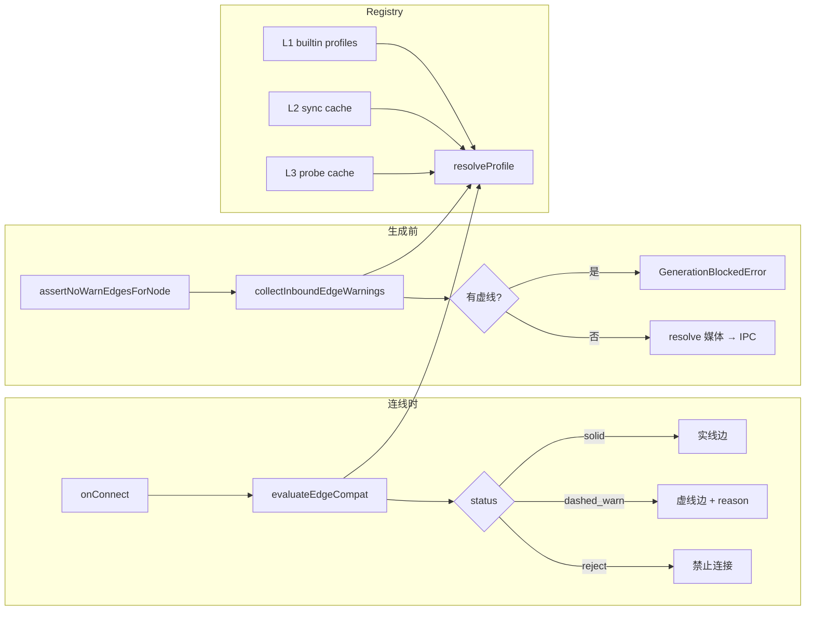

# LocalCanvas v6 — 节点体验打磨 + 模型能力系统完善

> **版本目标**：在 v5「意图驱动创作」基础上，完成**合成剪辑台**、**文本节点双栏编辑**、**模型能力 Registry** 三大重设计的落地与收尾，让画布连线、生成器、Agent 选模**以模型真实能力为准**，节点编辑体验达到可发布水准  
> **预计周期**：2.5 周（12 个工作日）  
> **前置条件**：v5 核心功能验收通过（Agent、DAG、分镜组、本地用户系统）  
> **生成日期**：2026-06-05  
> **设计详案**：`docs/v6/design/`（三份重设计原文）  
> **开发步骤**：`docs/LocalCanvas_开发步骤表.md` Phase 6

---

## 零、版本定位

v1–v4 搭建了画布与生成器；v5 引入 Agent、DAG、分镜组与用户系统。

v6 不新增大型功能模块，而是**把三条体验主线做透**——它们已在 v5 迭代后期并行落地大部分代码，v6 负责**验收、补缺、文档化与增值项收尾**：

| 主线 | 设计文档 | 一句话 |
|------|----------|--------|
| **合成编辑器** | [合成编辑器重设计](./v6/design/LocalCanvas_合成编辑器重设计.md) | 画布管连线，剪辑台管排列与导出 |
| **文本节点** | [文本节点重设计](./v6/design/LocalCanvas_文本节点重设计.md) | 草稿/输出分离，连线永远走 `output` |
| **模型能力系统** | [模型能力系统重设计](./v6/design/LocalCanvas_模型能力系统重设计.md) | 边是否合法由「上游模态 × 下游槽位」决定 |

> **与 v5 §十一「v6 演进」的关系**：v5 文档中的**云端服务端、导演台 3D、协作、移动端预览**为**独立产品轨道**（需另建 `localcanvas-server` 仓库），**不纳入本 v6 客户端文档范围**。本 v6 聚焦客户端节点体验与能力内核；云端迁移仍复用 v5 已预留的 `sync_status` / `cloud_user_id` 字段。

### 0.1 痛点 → 解法

| v5 末期痛点 | v6 解法 |
|-------------|---------|
| 合成节点内嵌片段列表与剪辑台重复 | **ComposeEditor** 大面板（75% 高）+ 时间轴即素材列表 |
| 文本节点四套字段、隐式输出规则 | **`draft` / `output` / `outputMode`** 双栏面板，下游只读 `output` |
| 连线与模型能力脱节（DeepSeek 接 3 图仍成功连线） | **CapabilityRegistry** + 虚线警告 + 生成前阻断 |
| Agent 写出画布无法执行的图 | **Registry 选模** + 能力目录注入 LLM 规划 |
| 设置页只见 endpoint，不知模型能吃什么 | **设置页重设计** + 能力徽章 + L2 同步 + L3 Probe |

### 0.2 成功标准（版本级）

| 指标 | 目标 |
|------|------|
| 合成导出路径 | 连线 → 剪辑台排序/裁切 → 导出 MP4 ≤ 5 分钟（熟练用户） |
| 文本节点认知 | 用户能明确回答「连线出去的是输出栏内容」 |
| 非法连线拦截 | `documented/verified` 能力下，生成前虚线边 100% 阻断 |
| 主流模型覆盖 | P0 内置目录 30+ profile；Seedance 2.0 / GPT-4o / DeepSeek V4 等可正确选模 |
| 测试 | `npm test` 全绿；`npm run build` 无 TS 错误 |

---

## 一、版本功能清单

### 1.1 总表

| # | 功能模块 | 子功能 | 优先级 | 状态 | 设计来源 |
|---|----------|--------|--------|------|----------|
| **A. 合成编辑器** |
| 1 | 剪辑台骨架 | 选中合成节点 → 75% 高 `ComposeEditor` | P0 | ✅ | 合成 §七 P1 |
| 2 | 剪辑台骨架 | 预览 + 传输控制 + 顺序时间轴 | P0 | ✅ | 合成 §四 |
| 3 | 裁切与检查器 | 片段边缘裁切、入出点、缩略图 | P0 | ✅ | 合成 §七 P2 |
| 4 | 体验打磨 | 专注模式、字幕轨、导出抽屉 | P0 | ✅ | 合成 §七 P3 |
| 5 | 合成后续 | FFmpeg 应用 `audioVolume` 混流 | P1 | ⬜ | 合成 §九-1 |
| 6 | 合成后续 | 导出进度条 + 取消按钮 UX | P2 | ⬜ | 合成 §九-2 |
| 7 | 合成后续 | 音频淡入淡出 | P2 | ⬜ | 合成 §九-4 |
| **B. 文本节点** |
| 8 | 数据模型 | `draft` / `output` / `outputMode` + 迁移 | P0 | ✅ | 文本 §五 |
| 9 | 编辑台 | `TextEditorPanel` 双栏 + 模式切换 | P0 | ✅ | 文本 §四 |
| 10 | 节点卡片 | 状态预览 + `TextOutputBadge` | P0 | ✅ | 文本 §七 P3 |
| 11 | 下游数据流 | `textNodeOutput()` 只读 `output` | P0 | ✅ | 文本 §六 |
| 12 | Vision 集成 | 多图 `image1…N` 端口 + 进 `generateText` | P0 | ✅ | 能力 §6 + 文本 |
| 13 | 思考档位 | `thinkingPreset` 三档 + `buildReasoningParams` | P0 | ✅ | 能力 §2.7 |
| **C. 模型能力系统** |
| 14 | 能力内核 | `ModelCapabilityProfile` + Registry + P0 内置目录 | P0 | ✅ | 能力 §二 |
| 15 | 画布连线 | 实线/虚线边 + `edge-compat` + 生成 guard | P0 | ✅ | 能力 §6.2 |
| 16 | 设置页 | 已接入模型 Tab + 能力徽章 + 详情抽屉 | P0 | ✅ | 能力 §5 |
| 17 | L2 同步 | 厂商 `/models` 列表缓存（SQLite + IPC） | P0 | ✅ | 能力 §4 |
| 18 | L3 Probe | 自定义 HTTP 能力验证 + 探测缓存 | P0 | ✅ | 能力 §4 |
| 19 | GeneratorPanel | 按 profile 动态参数（首尾帧、参考图等） | P0 | ✅ | 能力 §6.1 |
| 20 | 参考媒体 API | Seedream 多图 / Seedance 2.0 role 标注 | P0 | ✅ | 能力 §6 |
| 21 | 节点端口 | 视频 `reference1…9`、文本 `image1…N` 动态端口 | P0 | ✅ | 能力 §6.1 |
| 22 | Agent 选模 | `enrichWorkflowPlanWithModels` + 能力目录 prompt | P0 | ✅ | 能力 §6.3 |
| 23 | 槽位计数 UI | 节点 handle 旁 `2/9` 实时计数 | P1 | ⬜ | 能力 §7.1 |
| 24 | 连线健康检查 | 全项目虚线边一览 + 断开/探测 | P1 | ⬜ | 能力 §12.3 |
| 25 | 项目能力 Pin | `capability_catalog_version` + 升级提示 | P1 | ⬜ | 能力 §7.3 |
| 26 | `reasoning_content` | 思考链折叠展示，不进下游 output | P1 | ⬜ | 能力 §12.3 |
| 27 | Seedream 多参考图 | 图片节点 `reference1…4` 端口 | P1 | ⬜ | 能力 §9.1 |
| 28 | Custom Vision | `custom.ts` generateText 传 `images` | P2 | ⬜ | 能力 §9.1 |
| 29 | L2 扩展 | Anthropic / Google 无标准 `/models` 适配 | P2 | ⬜ | 能力 §4 |
| 30 | i18n 能力文案 | 徽章、拒绝原因中英文 | P2 | ⬜ | 能力 §9.1 |
| 31 | 能力图谱 | 项目级链路可执行性检查（增值） | P2 | ⬜ | 能力 §6.4 |
| 32 | 失败回写 Probe | `unsupported_multimodal` 自动再探测 | P2 | ⬜ | 能力 §7.4 |
| **D. 横切** |
| 33 | 实施计划 | `docs/superpowers/plans/2026-06-05-model-capability-system.md` | P0 | ✅ | — |
| 34 | 边状态持久化 | 重开项目后 `compatStatus` 重评估策略 | P1 | 🔶 | 能力 §12.2 |
| 35 | 切换模型 UX | 换模型后不合规入边标红/提示规则 | P1 | ⬜ | 能力 §9.1 |

**图例**：✅ 已交付　⬜ 待做　🔶 部分完成

### 1.2 已交付基线摘要（进入 v6 前）

以下在 v5 后期已合入主干，v6 以**回归验收 + 文档归档**为主：

- **合成**：`src/components/compose/*`、`composeEditorStore`、`composeSequence.ts`
- **文本**：`TextEditorPanel`、`TextNode` 状态卡片、`textNodeOutput.ts`
- **能力**：`src/capabilities/*`（registry、edge-compat、generator-ui、agent-model-select、probe 等）

实施记录见：`docs/superpowers/plans/2026-06-05-model-capability-system.md`（Task 13–20）。

---

## 二、技术架构（v6 相关模块）

```
┌─────────────────────────────────────────────────────────────────────────┐
│ Renderer Process                                                         │
│                                                                          │
│ ├── 合成剪辑台（compose/）                                               │
│ │   ├── ComposeEditor — 选中 compose 节点自动打开（75% 高）              │
│ │   ├── ComposeTimeline — 顺序模式单视频轨 + 字幕/音频轨                 │
│ │   └── dataFlow.ts — 连线 → clips 同步（trimIn / excluded）           │
│ │                                                                        │
│ ├── 文本编辑台（text/）                                                  │
│ │   ├── TextEditorPanel — draft | output 双栏 + 生成 + Vision 缩略图    │
│ │   ├── TextNode — 动态 image1…N 端口（profile 驱动）                    │
│ │   └── textNodeOutput() — 下游 prompt 唯一来源                          │
│ │                                                                        │
│ ├── 能力驱动 UI                                                          │
│ │   ├── node-port-ui.ts — 文本/图片/视频动态入边端口                     │
│ │   ├── canvasEdge.ts — solid / dashed_warn 样式                        │
│ │   ├── generation-guard.ts — 生成前聚合虚线边阻断                       │
│ │   ├── VideoGenerator / ImageGenerator — 参考媒体收集 → IPC            │
│ │   └── ModelSettingsSection — 能力徽章 + L2 同步 + Probe 按钮          │
│ │                                                                        │
│ └── Agent                                                                  │
│     ├── agent-service — skill / LLM 规划 → enrichWorkflowPlanWithModels   │
│     └── agent-catalog — 已接入模型能力目录注入 system prompt             │
│                                                                          │
├─────────────────────────────────────────────────────────────────────────┤
│ Main Process                                                             │
│ │   IPC: capability:probe / capability:sync / model:beginGenerate*      │
│ │   capability_probe_cache（SQLite）                                     │
│                                                                          │
├─────────────────────────────────────────────────────────────────────────┤
│ Utility Process                                                          │
│ │   remote-api.generateText — buildVisionUserContent（多图 Vision）      │
│ │   seedance.ts — buildSeedanceContent（role: first/last/reference）    │
│ │   reasoning-params — buildReasoningParams（思考三档）                  │
└─────────────────────────────────────────────────────────────────────────┘
```

### 2.1 能力解析链路



### 2.2 核心类型（`src/types/capability.ts`）

```typescript
export type EdgeCompatStatus = 'solid' | 'dashed_warn' | 'reject'

export interface InputSlotSpec {
  id: string           // prompt | image | reference_image | first_frame ...
  modality: Modality
  required?: boolean
  max_count: number
}

export interface ModelCapabilityProfile {
  profile_key: string
  provider: string
  model_pattern: string
  kind: ModelKind
  inputs: InputSlotSpec[]
  outputs: OutputSpec[]
  reasoning?: ReasoningProfile
  confidence: Confidence
  source: 'builtin' | 'sync' | 'probe' | 'custom'
}
```

### 2.3 关键文件索引

| 模块 | 路径 |
|------|------|
| 内置能力目录 | `src/capabilities/builtin/profiles.ts` |
| Registry | `src/capabilities/registry.ts` |
| 连线评估 | `src/capabilities/edge-compat.ts` |
| Handle 映射 | `src/capabilities/handle-slots.ts` |
| 生成阻断 | `src/capabilities/generation-guard.ts` |
| 动态端口 | `src/capabilities/node-port-ui.ts` |
| Vision 消息 | `src/capabilities/llm-vision-content.ts` |
| Agent 选模 | `src/capabilities/agent-model-select.ts` |
| 实施计划 | `docs/superpowers/plans/2026-06-05-model-capability-system.md` |

---

## 三、详细开发步骤

### Week 1（Day 1–5）：回归验收 + 文档归档

#### Day 1：合成剪辑台回归

**目标**：确认 [合成编辑器重设计](./v6/design/LocalCanvas_合成编辑器重设计.md) §八成功标准。

| 步骤 | 操作 | 验收 |
|------|------|------|
| 1.1 | 画布连线 3 路视频 + 1 路音频 → 合成节点 | clips 自动同步 |
| 1.2 | 打开剪辑台：拖拽排序、裁切、预览播放 | 指针与预览联动 |
| 1.3 | 导出 MP4 → 画布挂新视频节点 | `finishComposeAndCreateVideoNode` 正常 |
| 1.4 | 专注模式、字幕导入、排除片段 | 与 §四 一致 |
| 1.5 | 记录缺陷至 Issue；**不**扩 scope 到多轨/转场 | — |

#### Day 2：文本节点回归

**目标**：确认 [文本节点重设计](./v6/design/LocalCanvas_文本节点重设计.md) §九成功标准。

| 步骤 | 操作 | 验收 |
|------|------|------|
| 2.1 | 新建文本节点：草稿 → 同步到输出 → 连线图片 | 下游 `prompt` = `output` |
| 2.2 | LLM 生成：draft 不被覆盖，`outputMode=generated` | 徽章显示「AI 结果」 |
| 2.3 | GPT-4o + 多图 Vision 入边 → 生成 | `images` 进 API |
| 2.4 | DeepSeek + 图片入边 → 生成 | guard 阻断并提示 |
| 2.5 | DAG 执行文本节点 | 写 `output`，不写 `draft` |

#### Day 3–4：模型能力系统回归

**目标**：跑通 [模型能力系统重设计](./v6/design/LocalCanvas_模型能力系统重设计.md) 评审决议五项。

| 步骤 | 操作 | 验收 |
|------|------|------|
| 3.1 | Seedance 1.0 + lastFrame 连线 | 虚线；生成阻断 |
| 3.2 | Seedance 2.0 + reference1…9 + 首尾帧 | 实线；参考图进 API |
| 3.3 | 设置页：同步厂商列表、验证能力（Probe） | 缓存写入 + 徽章更新 |
| 3.4 | Agent：首尾帧技能 | 自动选 seedance-2-0 |
| 3.5 | `npm test` + `npm run build` | 全绿 |

#### Day 5：文档与计划对齐

- 更新 `docs/superpowers/plans/` Task checkbox 与 v6 总表状态一致
- 三份设计文档已归档至 `docs/v6/design/`（本步骤）
- 可选：在 `docs/agent-guide.md` 补充能力系统简述

---

### Week 2（Day 6–10）：P1 增值项

#### Day 6–7：槽位计数 + 生成前连线提示

**文件**：`PortHandle.tsx`、`VideoNode.tsx`、`TextNode.tsx`、`ImageNode.tsx`、`TextEditorPanel.tsx`

| 任务 | 说明 |
|------|------|
| handle 旁 `n/max` | 视频 reference、文本 image、图片 reference |
| 生成按钮旁警告条 | 「N 条未验证连线」可点击展开 |
| 单测 | `node-port-ui.test.ts` 扩展 |

#### Day 8：Seedream 多参考图端口

**对齐**：视频 `reference1…9` 模式，图片节点 `reference1…4`。

| 文件 | 变更 |
|------|------|
| `imageReferenceSlots.ts`（或复用模式） | handle 工具 |
| `node-port-ui.ts` | `getImageNodePorts` 多槽 |
| `ImageGenerator.tsx` | 收集 `referenceImages[]` |
| `portCompat` / `edge-compat` / `generation-guard` | 计数与兼容 |

#### Day 9：连线健康检查面板

**新建**：`src/components/panels/EdgeHealthPanel.tsx`（或设置页子 Tab）

- 列出当前项目所有 `dashed_warn` 边（source → target + reason）
- 操作：选中边、断开、跳转节点、「验证能力」

#### Day 10：`reasoning_content` 折叠展示

**文件**：`TextEditorPanel.tsx`、`remote-api.ts`（解析 `reasoning_content` 字段）

- 生成结果区下方可折叠「推理过程」
- **不写**入 `output`，不进入 `dataFlow`

---

### Week 2.5（Day 11–12）：P1/P2 择优 + 发布准备

| 候选（按优先级择一或两项） | 说明 |
|--------------------------|------|
| 项目能力 Pin | `project.json` 存 `capability_catalog_version`；打开时 diff 提示 |
| 切换模型 UX | 换模型后 `refresh-edge-compat` + 节点角标 |
| FFmpeg `audioVolume` | `compose-service` 混流滤镜 |
| Custom adapter Vision | `custom.ts` 传 `images` 模板变量 |

**发布检查**：

- [ ] `npm test` 全绿
- [ ] `npm run build` 成功
- [ ] 三份设计文档 §成功标准 勾选
- [ ] v6 总表 P0 项全部 ✅

---

## 四、数据模型变更摘要

### 4.1 文本节点 `TextNodeData`（已实施）

```typescript
export type TextOutputMode = 'passthrough' | 'generated'

export interface TextNodeData {
  title?: string
  draft?: string
  output?: string
  outputMode?: TextOutputMode
  outputEdited?: boolean
  modelId?: string
  systemPrompt?: string
  thinkingPreset?: ThinkingPreset
  editorLayout?: { splitRatio?: number }
}
```

### 4.2 合成节点 `ComposeNodeData`（已实施）

见 [合成编辑器重设计 §五](./v6/design/LocalCanvas_合成编辑器重设计.md)。

### 4.3 边扩展字段（已实施）

```typescript
// Edge.data
{
  compatStatus: 'solid' | 'dashed_warn'
  compatReason?: string
}
```

### 4.4 v6 拟新增（P1）

```typescript
// project.json
{
  capability_catalog_version?: number
  nodes: Array<{ profile_key?: string }>  // 可选钉扎
}
```

---

## 五、验收标准

### 5.1 合成编辑器

| # | 标准 | 引用 |
|---|------|------|
| 1 | 5 分钟内完成连线→排序→导出 | 合成 §八 |
| 2 | 片段列表仅时间轴一处 | 合成 §八 |
| 3 | 存量项目 `trimIn`/`excluded` 兼容 | 合成 §八 |

### 5.2 文本节点

| # | 标准 | 引用 |
|---|------|------|
| 1 | 用户能明确「连线出去的是 output」 | 文本 §九 |
| 2 | 编辑入口只有底部面板一处 | 文本 §九 |
| 3 | 生成后 draft 不被覆盖 | 文本 §九 |

### 5.3 模型能力系统

| # | 标准 | 引用 |
|---|------|------|
| 1 | 虚线边生成前 100% 阻断 | 能力 §1.3 |
| 2 | P0 模型 illegal 连线有可读 reason | 能力 §6.2 |
| 3 | Agent 规划经 Registry 选模 | 能力 §6.3 |
| 4 | 设置页无需读厂商文档即可理解能力 | 能力 §1.3 |

### 5.4 自动化

```bash
npm test
npm run build
```

Expected：Vitest 全通过；electron-vite build 无错误。

---

## 六、与 v5 对照

| v5 能力 | v6 关系 |
|---------|---------|
| Agent + WorkflowPlan | v6 接入 Registry 选模与能力目录 prompt |
| DAG 执行 | v6 文本节点补 Vision 图片收集；生成 guard 统一 |
| 分镜组 / Slash | 无冲突；文本/图片/视频节点能力更准确 |
| 本地用户系统 | 不变；云端迁移仍属独立轨道 |
| 合成 v3 Timeline | v6 升级为 ComposeEditor 剪辑台 |
| 设置页 v2 | v6 重设计为能力驱动设置 |

| v5 推迟项 | 本 v6 文档 |
|-----------|------------|
| 云端服务端 | ❌ 不在范围 |
| 导演台 3D | ❌ 不在范围 |
| 字幕擦除 | ❌ 不在范围（合成支持 SRT 叠加/烧录） |
| 移动端预览 | ❌ 不在范围 |

---

## 七、风险与应对

| 风险 | 影响 | 应对 |
|------|------|------|
| 三份设计并行落地，文档与代码漂移 | 验收遗漏 | v6 Day 1–4 专门回归；设计文档归档 `v6/design/` |
| 虚线边重开项目后状态丢失 | 用户误以为连线合法 | `refresh-edge-compat` + P1 健康检查面板 |
| Gemini/Claude 非 OpenAI 多模态格式 | Vision 生成失败 | P2 专用 adapter；一期以 OpenAI 兼容路径为主 |
| 槽位计数 UI 拥挤（9 参考 + 10 vision） | 节点过高 | 仅显示 `n/max` 文字徽章，不增加物理端口数 |
| Agent 选模与手动换模型冲突 | 计划 modelId 被覆盖 | enrich 保留用户显式 `data.modelId` |
| scope 膨胀到云端/导演台 | 无法 2.5 周交付 | 严格按 §零 边界；云端另立项目 |

---

## 八、设计文档索引

| 文档 | 路径 | 状态 |
|------|------|------|
| 合成编辑器重设计 | [v6/design/LocalCanvas_合成编辑器重设计.md](./v6/design/LocalCanvas_合成编辑器重设计.md) | ✅ 基线已实施 |
| 文本节点重设计 | [v6/design/LocalCanvas_文本节点重设计.md](./v6/design/LocalCanvas_文本节点重设计.md) | ✅ 基线已实施 |
| 模型能力系统重设计 | [v6/design/LocalCanvas_模型能力系统重设计.md](./v6/design/LocalCanvas_模型能力系统重设计.md) | ✅ 核心已实施 |
| 能力系统实施计划 | [superpowers/plans/2026-06-05-model-capability-system.md](./superpowers/plans/2026-06-05-model-capability-system.md) | Task 13–20 ✅ |
| v5 总览（前序版本） | [LocalCanvas_v5_Agent自动化与分镜增强.md](./LocalCanvas_v5_Agent自动化与分镜增强.md) | 已发布基线 |
| 开发步骤表 Phase 6 | [LocalCanvas_开发步骤表.md](./LocalCanvas_开发步骤表.md#phase-6节点体验--模型能力系统v6-客户端约-25-周) | 任务拆解 |

---

## 九、评审确认决议（能力系统，2026-06-05）

摘自 [模型能力系统重设计 §零](./v6/design/LocalCanvas_模型能力系统重设计.md)：

| # | 议题 | 决议 |
|---|------|------|
| 1 | P0 最低模型集 | ✅ presets + GPT-4o + Claude + Gemini + DeepSeek V4 |
| 2 | 非法连线策略 | ✅ 虚线警告 + 生成前硬阻断 |
| 3 | L4 远程签名目录 | ❌ 不做 |
| 4 | 自定义 HTTP | ✅ 静态推断 + 可选 Probe |
| 5 | 反思建议 | 见能力文档 §十二；v6 Week 2 择项落地 |

---

*本文档由三份重设计文档梳理生成，作为 v6 客户端迭代的需求基线。实施时以 `docs/superpowers/plans/` 任务.checkbox 与本文 §一 状态列同步更新。*
