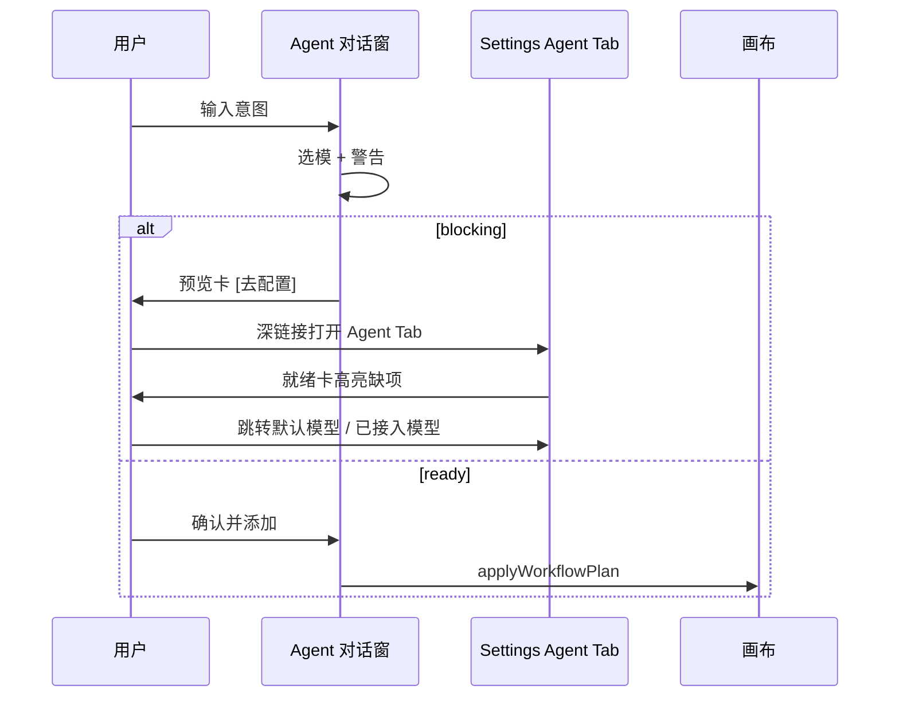

# LocalCanvas Agent UI 设计（v11）

> **文档性质**：界面与交互设计 · 与功能设计同步  
> **功能锚点**：[LocalCanvas_Agent功能设计.md](./LocalCanvas_Agent功能设计.md) · [复杂片型生产模型](./LocalCanvas_Agent-复杂片型生产模型.md)  
> **视觉锚点**：[v8 视觉语言与设计令牌](../v8/design/01_视觉语言与设计令牌.md) · [v8 交互语法](../v8/design/03_交互语法与微反馈.md)  
> **代码触点**：`SettingsAgentTab`（待建）· `AgentCompanion` · `AgentPanel` · `WorkflowPlanPreview`

---

## 〇、设计同步说明

本文件是功能设计的 **UI 落地方案**，两页共用同一套信息架构与状态语义：

| 界面 | 用户心智 | 与功能设计对应 |
|------|----------|----------------|
| **Agent 设置页** | 「能不能跑、默认怎么跑」 | §六 Settings Agent Tab · 能力预检 · 模板开关 |
| **Agent 对话窗** | 「现在要做什么、方案是什么」 | §五 入口矩阵 · Plan/Build · HITL 预览 |

**UI 立场**（与功能文档一致）：

- 对话窗是 **工作流 Copilot**，不是聊天 App — 消息区服务于计划/补丁/模板卡片
- 设置页是 **就绪检查 + 偏好**，不是第二个模型配置中心 — 改模型跳「默认模型」Tab
- 两界面通过 **深链接** 闭环：对话里 blocking 警告 → 设置页 Agent Tab 对应区块

---

## 一、共享规范

### 1.1 视觉令牌

沿用 Studio Dark，禁止新增硬编码色。

| 用途 | Token / 类 |
|------|------------|
| 面板底 | `bg-bg-secondary` |
| 输入底 | `bg-bg-tertiary` |
| 边框 | `border-border` / `var(--studio-border)` |
| 主操作 | `bg-accent` · `hover:bg-accent-hover` |
| 强调文案 | `text-accent` |
| 成功/警告/错误 | `text-success` / `text-warning` / `text-danger` · `bg-* /10` |
| 运行中 | `var(--status-running)` |
| 浮岛玻璃 | `bg-bg-secondary/95 backdrop-blur` |

### 1.2 字号层级（窄面板）

| 层级 | 字号 | 场景 |
|------|------|------|
| 面板标题 | `text-xs font-medium` | Companion 顶栏 |
| 正文/气泡 | `text-xs` | 对话消息 |
| 辅助 | `text-[10px] text-text-muted` | 节点列表、历史项 |
| 区块标题 | `text-sm font-medium` | 设置页 Section |
| 设置说明 | `text-xs text-text-muted` | 设置页引导段 |

### 1.3 间距与圆角

- 面板内边距：`p-3`（对话）/ `p-6`（设置内容区，与现有 Settings 一致）
- 卡片圆角：`rounded-lg`；浮岛外框：`rounded-xl`
- 区块间距：`space-y-4`（设置）/ `space-y-3`（消息流）

### 1.4 z-index 层级

| 层 | z-index | 组件 |
|----|---------|------|
| Slash 面板 | 60 | 不被 Agent 挡 |
| Agent 浮岛 / FAB | **70** | 与 ConfirmDialog 同级 |
| GeneratorDrawer | 80 | 展开时 Agent 浮岛 **自动收起**（见 §3.6） |
| 快捷键/Coach | 110 | 最高引导层 |

钉住侧栏模式不占 z-index，作为 EditorShell 布局列（`w-80`），与 Inspector 互斥（已有逻辑）。

---

## 二、Agent 设置页 UI

### 2.1 入口与布局

**入口**：顶栏 ⚙️ 设置 → Tab **🤖 Agent**（`settings.tabAgent`）

**布局骨架**（与 `SettingsDefaultsTab` 等同构）：

```
┌─────────────────────────────────────────────────────────────┐
│ 内置能力目录 v…                    （Settings 顶栏，共用）    │
├─────────────────────────────────────────────────────────────┤
│ 🧩已接入模型 │ ⭐默认模型 │ 🤖Agent │ 🛠媒体 │ 🌐界面 │ ⌨️快捷键 │
├─────────────────────────────────────────────────────────────┤
│  max-w-4xl mx-auto p-6                                      │
│                                                             │
│  §2.2 就绪状态卡                                             │
│  §2.3 规划模型                                               │
│  §2.4 工作流模板                                             │
│  §2.5 执行偏好                                               │
│  §2.6 帮助链接                                               │
│                                                             │
├─────────────────────────────────────────────────────────────┤
│ 自动保存提示                          [关闭] [保存并关闭]      │
└─────────────────────────────────────────────────────────────┘
```

**组件**：`SettingsAgentTab.tsx`，由 `SettingsPanel` 在 `activeTab === 'agent'` 时渲染。

### 2.2 就绪状态卡（Readiness Card）— Slice A P0

页面 **第一屏** 回答「Agent 现在能不能用」。

```
┌─ Agent 就绪状态 ────────────────────────────────────────────┐
│  ● 就绪 / ○ 需配置                                         │
│                                                             │
│  ✓ 默认 LLM    DeepSeek V3          [更改 →]                │
│  ✓ 默认图像    Seedream 4.5         [更改 →]                │
│  ✓ 默认视频    Seedance 2.0         [更改 →]                │
│  ⚠ 尾帧能力    未检测到支持尾帧的视频模型  [去添加 →]          │
└─────────────────────────────────────────────────────────────┘
```

| 行项 | 数据源 | 状态图标 | 操作 |
|------|--------|----------|------|
| 默认 LLM | `config.settings.default_llm` + Key 检测 | ✓/✗ | `[更改 →]` 切 Tab `defaults` 并 scroll 到 LLM |
| 默认图像 | `default_image_model` | ✓/○ 可选 | 同上 |
| 默认视频 | `default_video_model` | ✓/○ | 同上 |
| 尾帧能力 | 能力目录扫描 | ✓/⚠ | `[去添加 →]` 切 Tab `models` 或文档锚点 |
| Vision | 有图入边 LLM 需求时显示 | ✓/⚠ | 同上 |

**整体状态**：

- `ready`：LLM ✓ 且无任何 `blocking` 项
- `needs_setup`：缺 LLM 或存在 blocking
- 顶栏 Agent Tab 可加 **小圆点**（`needs_setup` 时 `var(--status-warning)`）— 可选 P1

**样式**：

```tsx
// 就绪卡容器
className="rounded-lg border border-border bg-bg-tertiary/50 p-4 space-y-3"
// 行
className="flex items-center justify-between gap-3 text-sm"
// blocking 行
className="text-warning"
```

### 2.3 规划模型（只读 + 跳转）

```
┌─ 规划模型 ──────────────────────────────────────────────────┐
│  Agent 使用「默认 LLM」生成工作流计划，不单独存储 API Key。    │
│                                                             │
│  当前：DeepSeek V3  （只读文本，非 select）                  │
│                                                             │
│  [在「默认模型」中修改]                                       │
└─────────────────────────────────────────────────────────────┘
```

- **不用**下拉框重复配置 — 避免与「默认模型」Tab 双源真相
- 按钮：`onClick` → `setActiveTab('defaults')` + `sessionStorage` 高亮 `default_llm` 字段

### 2.4 工作流模板开关 — Slice A P0

取代原「应用设置 → Agent 预置技能」勾选 UI。

```
┌─ 工作流模板 ────────────────────────────────────────────────┐
│  关闭后，Agent 不会在对话中推荐该模板；LLM 回退时也不使用。    │
│                                                             │
│  ☑ 文生图生视频     文本→图像→视频 · 自动执行                │
│  ☑ 首尾帧过渡       双文本双图→视频 · 需尾帧模型             │
│  ☑ 脚本成片         脚本+合成骨架 · 检查点暂停               │
│  ☐ …（与 registry 同步，最多展示内置项）                      │
│                                                             │
│  每项：主标题 + 一行 description（text-[10px] muted）          │
└─────────────────────────────────────────────────────────────┘
```

| 交互 | 行为 |
|------|------|
| Toggle | 即时写 `localStorage` `lc-agent-disabled-templates` |
| 兼容 | 首次读取合并旧 key `lc-agent-disabled-skills` |
| 缺能力模板 | Toggle 禁用 + 行尾 `⚠ 缺尾帧` 标签 |

**控件样式**：与 `SettingsGeneralTab` 复选框行一致 — `flex items-start gap-3 py-2`

### 2.5 执行偏好 — Slice A 可选 / B 完整

```
┌─ 执行偏好 ──────────────────────────────────────────────────┐
│  默认模式    (●) 自动  有选中节点→构建，无选中→规划          │
│              ( ) 始终规划  ( ) 始终构建                      │
│                                                             │
│  ☑ 确认后自动执行（仅 executionMode=auto 的计划）            │
│  ☑ 长链路在分镜/脚本后暂停（checkpoint）                     │
└─────────────────────────────────────────────────────────────┘
```

| 键 | 控件 | 默认 |
|----|------|------|
| `lc-agent-default-mode` | 三选一 radio | `auto` |
| `lc-agent-auto-run` | checkbox | 开 |
| `lc-agent-checkpoint-enabled` | checkbox | 开 |

变更即时 localStorage 保存（与模板开关一致），**不需**点「保存并关闭」。

### 2.6 帮助区

```
┌─ 了解更多 ──────────────────────────────────────────────────┐
│  📄 Agent 使用指南                                          │
│  📄 工作流模板对照                                          │
└─────────────────────────────────────────────────────────────┘
```

- 链接打开应用内文档路由或系统浏览器 `docs/v5/agent-guide.md`
- `text-xs text-accent hover:underline` 列表

### 2.7 深链接协议（对话窗 → 设置页）

对话窗 blocking 警告按钮携带 hash，设置页 mount 时解析：

| 链接参数 | 滚动目标 |
|----------|----------|
| `?settings=agent` | 打开 Agent Tab |
| `?settings=agent&focus=readiness` | 就绪卡 |
| `?settings=agent&focus=templates` | 模板区 |
| `?settings=defaults&field=default_llm` | 默认模型 Tab |

实现：`editorShellStore.openSettings({ tab: 'agent', focus })` — 与功能设计 §3.5 blocking 跳转一致。

### 2.8 i18n 键（新增建议）

```json
"settings.tabAgent": "🤖 Agent",
"settings.agent.readinessTitle": "Agent 就绪状态",
"settings.agent.readinessReady": "就绪",
"settings.agent.readinessNeedsSetup": "需完成配置",
"settings.agent.plannerTitle": "规划模型",
"settings.agent.plannerHint": "Agent 使用「默认 LLM」生成工作流计划。",
"settings.agent.changeInDefaults": "在「默认模型」中修改",
"settings.agent.templatesTitle": "工作流模板",
"settings.agent.templatesHint": "关闭后不会在对话中推荐该模板。",
"settings.agent.prefsTitle": "执行偏好",
"settings.agent.defaultModeAuto": "自动（有选中→构建，无选中→规划）",
"settings.agent.autoRun": "确认后自动执行",
"settings.agent.checkpoint": "长链路在分镜/脚本后暂停",
"settings.agent.helpTitle": "了解更多"
```

---

## 三、Agent 对话窗 UI

### 3.1 壳层：AgentCompanion

两种形态共用 **同一** `AgentPanel` 内容，仅外壳不同。

#### 形态 A — 浮岛（默认）

```
                    ┌──────────────────────────┐
                    │ Agent          [钉住] [✕] │
                    ├──────────────────────────┤
                    │  （AgentPanel 内容）      │
                    │                          │
                    └──────────────────────────┘
     画布                              FAB 🤖（收起时）
```

| 属性 | 值 |
|------|-----|
| 定位 | `fixed bottom-4 right-4` |
| 宽 | `w-80`（320px） |
| 高 | `max-h-[min(480px,70vh)]` |
| 层级 | `z-[70]` |
| 外观 | `rounded-xl border studio-border shadow-xl backdrop-blur` |

**FAB（收起）**：

- `w-14 h-14 rounded-full`
- 有 `pendingPlan` 或未读回复：`ring-2 ring-[var(--studio-accent)]`
- 与全局 Toast（`z-[100]`）错开：Toast 在上，FAB 不遮挡 Toast 关闭区

#### 形态 B — 钉住侧栏

```
┌──────── 画布 ────────┬── Agent ──────────┐
│                      │ [取消钉住]         │
│                      │ AgentPanel         │
│                      │                    │
└──────────────────────┴────────────────────┘
```

| 属性 | 值 |
|------|-----|
| 宽 | `w-80 shrink-0` |
| 位置 | EditorShell 主行最右列 |
| 与 Inspector | 钉住时 Inspector 隐藏（已实现） |

顶栏 **不再重复**「Agent」标题两次 — v11 合并为单层：Companion 壳层保留标题，Panel 内工具条只保留「历史 / 新对话」。

### 3.2 AgentPanel 信息架构

```
┌─────────────────────────────────────────┐
│ 工具条： [历史 (n)]  [新对话]            │  shrink-0
├─────────────────────────────────────────┤
│ 历史下拉（可折叠）                        │  shrink-0, max-h-32
├─────────────────────────────────────────┤
│ 消息流（flex-1 overflow-y-auto）         │
│   · 空状态引导                           │
│   · 用户气泡                             │
│   · 助手气泡 + 内嵌卡片                   │
│   · 计划/补丁预览（吸底或内嵌）            │
├─────────────────────────────────────────┤
│ 输入区（shrink-0）                       │
│   · Focused 芯片行（v11.1）              │
│   · Plan|Build 切换（v11.0 简版）        │
│   · textarea + 发送                      │
│   · 阶段状态条（v11.2）                  │
└─────────────────────────────────────────┘
```

### 3.3 工具条

| 控件 | 样式 | 行为 |
|------|------|------|
| 历史 | `text-[10px] px-2 py-1 rounded border border-border` | 切换 `historyOpen`；显示 `sessions.length` |
| 新对话 | 同上 | 清空 store，不关壳层 |

历史列表：

- 每项：`title || 未命名会话` + `updatedAt` 本地化
- 当前会话：`text-[var(--studio-accent)]`
- 超长按 `truncate`

### 3.4 空状态

```
描述你想做的视频，我会推荐工作流模板或生成计划。

试试：
· 30 秒咖啡品牌广告，竖屏，多镜头
· 2 分钟故事短片，两个角色
· 5 秒产品空镜（单镜头）
```

- 主文案：`agent.emptyHint`（区分 Lite / Studio 示例）
- 示例：`text-[10px] text-text-muted`，点击 **填入输入框** 不自动发送

### 3.5 消息气泡

#### 用户消息

```
                    ┌─────────────────────────┐
                    │ 做一个咖啡宣传片         │
                    │ @咖啡主图               │  ← v11.1 Focused pills
                    └─────────────────────────┘
```

```tsx
className="text-xs rounded-lg px-3 py-2 bg-accent/20 text-text-primary ml-6"
```

#### 助手消息

```tsx
className="text-xs rounded-lg px-3 py-2 bg-bg-tertiary text-text-primary mr-6"
```

- `whitespace-pre-wrap` 保留警告换行
- **不在**气泡内放主操作按钮（除模板卡片外）— 主操作集中在预览卡

#### 助手消息 — 模板候选卡片组（Slice A）

置于助手气泡 **下方** 或气泡 **内底部**，最多 3 张：

```
┌─ 推荐模板 ─────────────────────────────┐
│ ┌──────────────────────────────────┐  │
│ │ 文生图生视频          [采纳]      │  │
│ │ 文本→图像→视频 · 自动执行         │  │
│ │ 匹配度 ████░                      │  │
│ └──────────────────────────────────┘  │
│ ┌──────────────────────────────────┐  │
│ │ 脚本成片              [采纳]      │  │
│ │ …                                 │  │
│ └──────────────────────────────────┘  │
│ [跳过，让 AI 自由规划]                 │
└───────────────────────────────────────┘
```

| 元素 | 样式 |
|------|------|
| 卡片 | `p-2.5 rounded-lg border border-border hover:border-accent/50 transition` |
| 采纳 | `text-[10px] px-2 py-1 rounded bg-accent text-white` |
| 跳过 | `text-[10px] text-text-muted hover:text-accent underline` |
| 不可用 | `opacity-50` + 禁用采纳 + `⚠ 缺尾帧` |

点击采纳 → 不再次 chat，直接走模板 `buildPlan` → 选模 → 出 `pendingPlan`。

### 3.6 计划 / 补丁预览卡（HITL L1）

升级 `WorkflowPlanPreview`，与功能设计 §4.2 动作集对齐。

```
┌─ 工作流计划 ───────────────────────────────────────────────┐
│ 将创建：文本→图像→视频；已选模：DeepSeek、Seedream、Seedance  │
│                                                            │
│  ⚠ 无完全匹配尾帧模型，已选最接近项…                         │  ← degraded
│                                                            │
│  1. 文案节点 (text-1)                                      │
│  2. 主图 (image-1)                                         │
│  3. 成片 (video-1)                                         │
│                                                            │
│  执行：自动 / 仅落盘 / 检查点暂停   ← executionMode 标签     │
│                                                            │
│  [确认并添加]  [换一个方案]  [取消]                          │
│  [去配置]  ← 仅 blocking 时显示 Primary                     │
└────────────────────────────────────────────────────────────┘
```

| 状态 | 主按钮 | 次按钮 |
|------|--------|--------|
| 正常 | 确认并添加 | 换一个方案 · 取消 |
| blocking | **去配置**（跳设置） | 取消 |
| `manual` | 确认并添加（不自动 DAG） | 只落盘不执行 |
| Build 补丁（v11.1） | 确认应用补丁 | 取消 |

**样式**（延续现有，扩展）：

```tsx
className="p-3 rounded-lg border border-accent/40 bg-bg-tertiary/80"
// 警告
className="text-[10px] text-warning"
// 节点列表
className="text-[10px] text-text-muted list-decimal list-inside"
```

**补丁预览差异**：列表项前缀用 `+` `~` `-` 表示增改删；显示 `锚定：咖啡主图 (image-1)`。

### 3.7 输入区

#### v11.0 布局

```
┌─────────────────────────────────────────┐
│  Plan │ Build        （分段切换）        │  ← 有选中时 Build 高亮
├─────────────────────────────────────────┤
│  ┌─────────────────────────────────┐   │
│  │ 例如：做一个 15 秒咖啡品牌…      │   │  textarea, min-h-[40px]
│  └─────────────────────────────────┘   │
│                            [发送]      │
└─────────────────────────────────────────┘
```

| 控件 | 说明 |
|------|------|
| 模式切换 | 分段控件 `rounded-full bg-bg-tertiary p-0.5`；激活项 `bg-accent text-white text-[10px] px-2 py-1 rounded-full` |
| 自动模式 | 无选中 → Plan 激活；有选中 → Build 激活；用户可手动覆盖 |
| 输入 | `textarea` 替代 `input`，支持 Shift+Enter 换行，Enter 发送 |
| 发送 | `disabled={sending \|\| !trim}`；发送中显示 `…` 或 spinner |

#### v11.1 — Focused 芯片行（n8n 参照）

位于 textarea **上方**：

```
┌─────────────────────────────────────────┐
│ [咖啡主图 ×] [文案节点 ×]   [+ 添加选中]  │
└─────────────────────────────────────────┘
```

- 芯片：`text-[10px] px-2 py-0.5 rounded-full bg-accent/15 text-accent border border-accent/30`
- 与画布选中双向同步；发送后 **清空** 芯片（不清空画布选中）
- 输入 `@` 弹出节点下拉（`max-h-32` scroll）— P1 可简化为仅同步画布选中

#### v11.2 — 阶段状态条

发送中在输入区上方显示 **非 token** 阶段：

```
召回模板… → 选择模型… → 生成计划…
```

- `text-[10px] text-[var(--status-running)]`
- 失败：红字一行 + Toast 详情

### 3.8 加载与错误

| 状态 | UI |
|------|-----|
| `sending` | 禁用输入；消息区底部可选 skeleton 行 |
| 无效 plan | Toast；不展示预览卡 |
| API Key 错误 | 助手文案 + 预览区 `[去配置]` |
| 网络错误 | Toast + 消息内「重试」链（重新发送最后 user 消息）— P2 |

### 3.9 与 GeneratorDrawer 协同

| 事件 | Agent 浮岛行为 |
|------|----------------|
| Drawer 打开（`z-80`） | 若未钉住，**自动收起**浮岛（保留 FAB） |
| Drawer 关闭 | 不自动再展开 |
| 钉住模式 | 与 Drawer 共存；EditorShell 列宽总和需 ≤ 视口 |

避免右下角 **FAB + Drawer 把手** 重叠：FAB `bottom-4`，Drawer 把手在 Drawer 顶边，不冲突。

### 3.10 快捷键

| 键 | 行为 |
|----|------|
| `/agent` | 打开浮岛并 focus textarea |
| `Esc` | 浮岛展开时关闭（钉住模式 Esc 不关闭） |
| `Enter` | 发送（textarea 内 Shift+Enter 换行） |

### 3.11 复杂片型 UI（Studio 轨道）

> 数据结构见 [复杂片型专章](./LocalCanvas_Agent-复杂片型生产模型.md)。窄面板（320px）下采用 **纵向卡片栈**，不挤水平表格。

#### 3.11.1 片型标签（助手消息头）

```
┌──────────────────────────────────────┐
│ 🎬 品牌广告片 · Studio    约 30s · 9:16 │
└──────────────────────────────────────┘
```

- `text-[10px] px-2 py-0.5 rounded bg-accent/10 text-accent inline-block mb-1`
- Lite 片型显示 `⚡ 单镜头 · Lite`

#### 3.11.2 Brief 卡（CP-Brief，v12 P0）

用户 **必须先确认** Brief，才出现 Shot List。

```
┌─ 制作简报 ─────────────────────────────┐
│ 片型      品牌广告片                      │
│ 时长      30s   [改]                     │
│ 画幅      9:16  [改]                     │
│ 调性      电影感、温暖                    │
│ 必含      咖啡豆特写、手冲、slogan 落版    │
│ 检查点    严格（脚本后 / 分镜图后 / 合成前）│
│                                        │
│ [确认简报，生成镜头表]  [修改意图]        │
└────────────────────────────────────────┘
```

- 可编辑字段 v11.2：时长、画幅、调性（L2 参数微调）
- Primary：`确认简报`；未确认前 **隐藏** 「确认并添加画布」

#### 3.11.3 镜头表 Shot List（可折叠）

```
┌─ 镜头表 · 6 镜 / 约 28s ─── [展开] ────┐
│ #  Beat   时长  模式   摘要              │
│ 1 HOOK    4s   i2v   咖啡豆微距          │
│ 2 HERO    5s   i2v   手冲过程            │
│ 3 HERO    5s   i2v   成品特写            │
│ …                                      │
│ SC01–SC02 分组分隔线（叙事片）           │
└────────────────────────────────────────┘
```

| 列 | 宽 | 样式 |
|----|-----|------|
| # | 20px | `text-[10px] tabular-nums` |
| Beat | 48px | `text-[10px] uppercase text-accent` |
| 时长 | 32px | muted |
| 模式 | 28px | `t2v`/`i2v`/`flf` badge |
| 摘要 | flex | `truncate` |

- 默认折叠显示前 3 镜 +「还有 N 镜」
- 点击行 → 画布高亮对应 script row（落盘后）

#### 3.11.4 阶段时间轴 Phase Rail

```
Brief ✓ — 镜头表 ✓ — 分镜图 ○ — 成片 ○ — 合成 ○
●────────●────────○────────○────────○
```

- `text-[9px]` 横向 scroll；当前阶段 `text-accent`；已完成 `text-success`；checkpoint 待审 `text-warning`
- 与 DAG / checkpoint 状态同步（v12）

#### 3.11.5 Production 预览卡（替代简单 WorkflowPlanPreview）

Studio 确认落盘前的主卡片：

```
┌─ 制作计划 · 品牌广告片 ──────────────────┐
│ 阶段轴（§3.11.4）                         │
│ 将落盘：                                  │
│  · 分镜脚本 (script)                      │
│  · 分镜组 (storyboard)                    │
│  · 合成 (compose) + 音频占位              │
│ 展开：skeleton（6 镜在脚本内，不铺 18 节点）│
│ 执行：检查点暂停 · 不自动跑全片            │
│ 已选模：…                                 │
│ [确认并添加] [换一个方案] [只改镜头表]     │
└──────────────────────────────────────────┘
```

**与 Lite 预览卡差异**：

| 项 | Lite | Studio |
|----|------|--------|
| 节点列表 | 枚举 3–5 节点 | 仅列 **骨架节点类型** |
| 主按钮文案 | 确认并添加 | 确认并添加制作骨架 |
| auto 标签 | 可显示 | **禁止**显示 auto |

#### 3.11.6 钉住模式加宽（Studio 可选）

复杂片审阅时，用户可 **拖拽加宽** Agent 侧栏 `320px → 400px`（`editorShellStore.agentPaneWidth`），仅钉住态生效，避免浮岛挡画布。

#### 3.11.7 模板卡片扩展（片型）

召回卡片增加片型模板，带 Beat 摘要：

```
┌──────────────────────────────────┐
│ 品牌广告片 · 30s        [采纳]    │
│ HOOK→HERO→STORY→CTA · 检查点     │
│ 6–8 镜 · skeleton                │
└──────────────────────────────────┘
```

### 3.12 设置页 — 片型能力预检（扩展 §2.2）

就绪卡按 **用户最常做的 Studio 片型** 展示能力矩阵：

| 片型 | 预检项 |
|------|--------|
| 品牌/产品片 | LLM、图、视频、参考图 |
| 叙事短片 | + 长时长 checkpoint 说明 |
| 蒙太奇 | + TTS（旁白，可选） |

行尾链接：[复杂片型制作说明](./LocalCanvas_Agent-复杂片型生产模型.md)

---

## 四、两界面联动



| 从 | 到 | 触发 |
|----|-----|------|
| 预览卡 | Settings Agent | `[去配置]` blocking |
| 预览卡 | Settings 默认模型 | LLM 缺失 |
| 预览卡 | Settings 已接入模型 | 尾帧/Vision 缺模型 |
| Settings 帮助 | agent-guide | 文内链接 |
| 画布右键 | 对话窗 Build | 「交给 Agent 扩展」— v11.1 |

---

## 五、组件清单与文件映射

| 组件 | 文件 | Slice |
|------|------|-------|
| `SettingsAgentTab` | `src/components/panels/SettingsAgentTab.tsx` | A |
| `AgentReadinessCard` | 同上或子组件 | A |
| `AgentTemplateToggles` | 同上 | A |
| `AgentCompanion` | `src/components/agent/AgentCompanion.tsx` | A 抛光 |
| `AgentPanel` | `src/components/panels/AgentPanel.tsx` | A/B |
| `AgentModeSwitch` | `src/components/agent/AgentModeSwitch.tsx` | A |
| `AgentTemplateCards` | `src/components/agent/AgentTemplateCards.tsx` | A |
| `AgentFocusedChips` | `src/components/agent/AgentFocusedChips.tsx` | B |
| `WorkflowPlanPreview` | `src/components/panels/WorkflowPlanPreview.tsx` | A/B |
| `ProductionPlanPreview` | `src/components/agent/ProductionPlanPreview.tsx` | D (v12) |
| `AgentBriefCard` | `src/components/agent/AgentBriefCard.tsx` | D |
| `AgentShotList` | `src/components/agent/AgentShotList.tsx` | D |
| `AgentPhaseRail` | `src/components/agent/AgentPhaseRail.tsx` | D |
| `GraphPatchPreview` | `src/components/panels/GraphPatchPreview.tsx` | B |
| `AgentPhaseStatus` | `src/components/agent/AgentPhaseStatus.tsx` | C |

**Store 扩展**：

- `agentStore`：`mode: 'plan' | 'build'`、`focusedNodeIds`、`phase: AgentPhase | null`
- `editorShellStore`：`openSettings({ tab, focus })`

---

## 六、交付切片对照

| Slice | 设置页 UI | 对话窗 UI |
|-------|-----------|-----------|
| **A** | Agent Tab + 就绪卡 + 模板开关 + 执行偏好（checkbox） | 模板卡片 + 模式切换 + 预览卡 blocking 跳转 + textarea |
| **B** | checkpoint 说明 tooltip | Focused 芯片 + GraphPatch 预览 + 「换一个方案」 |
| **C** | Tab 警告圆点 | 阶段状态条 + L2 参数微调行 + 示例点击填入 |
| **D (v12)** | 片型能力矩阵 | Brief 卡 + Shot List + Phase Rail + Production 预览 |

---

## 七、现状差距（Gap）

| 项 | 现状 | v11 目标 |
|----|------|----------|
| Settings Agent Tab | 无独立 Tab；技能在 general | 独立 Tab + 就绪卡 |
| 规划 LLM | 与默认模型混在 defaults | Agent Tab 只读 + 跳转 |
| 模板采纳 | Skill 静默命中 | 卡片 Top 3 + 采纳/跳过 |
| 预览动作 | 确认 / 取消 | + 换一个方案 / 去配置 |
| 输入框 | 单行 input | textarea + Plan/Build |
| Focused | 无 | 芯片 + 画布同步 |
| 浮岛 vs Drawer | 无自动收起 | Drawer 开时收起浮岛 |
| i18n | 部分硬编码中文 | 工具条/壳层键入 zh-CN / en-US |

---

## 八、验收要点（UI）

- [ ] Agent Tab 与对话窗模板开关状态一致（同一 localStorage key）
- [ ] 就绪卡 blocking 项与预览卡 `[去配置]` 跳转同一 focus 区块
- [ ] 浮岛 `z-70` 不遮挡 Slash；Drawer 打开时浮岛收起
- [ ] 钉住宽 320px 下预览卡按钮不溢出（小屏纵向堆叠）
- [ ] 所有新区域使用 `studio-*` / `bg-bg-*`，无 raw `zinc-*`
- [ ] `prefers-reduced-motion`：浮岛展开无 scale 动画（仅 opacity，与 v8 一致）

---

## 相关文档

- [复杂片型生产模型](./LocalCanvas_Agent-复杂片型生产模型.md)
- [Agent 功能设计](./LocalCanvas_Agent功能设计.md)
- [v11 版本规划](./LocalCanvas_v11_Agent与设置增强.md)
- [Agent 使用指南](../v5/agent-guide.md)
- [v8 视觉语言](../v8/design/01_视觉语言与设计令牌.md)
