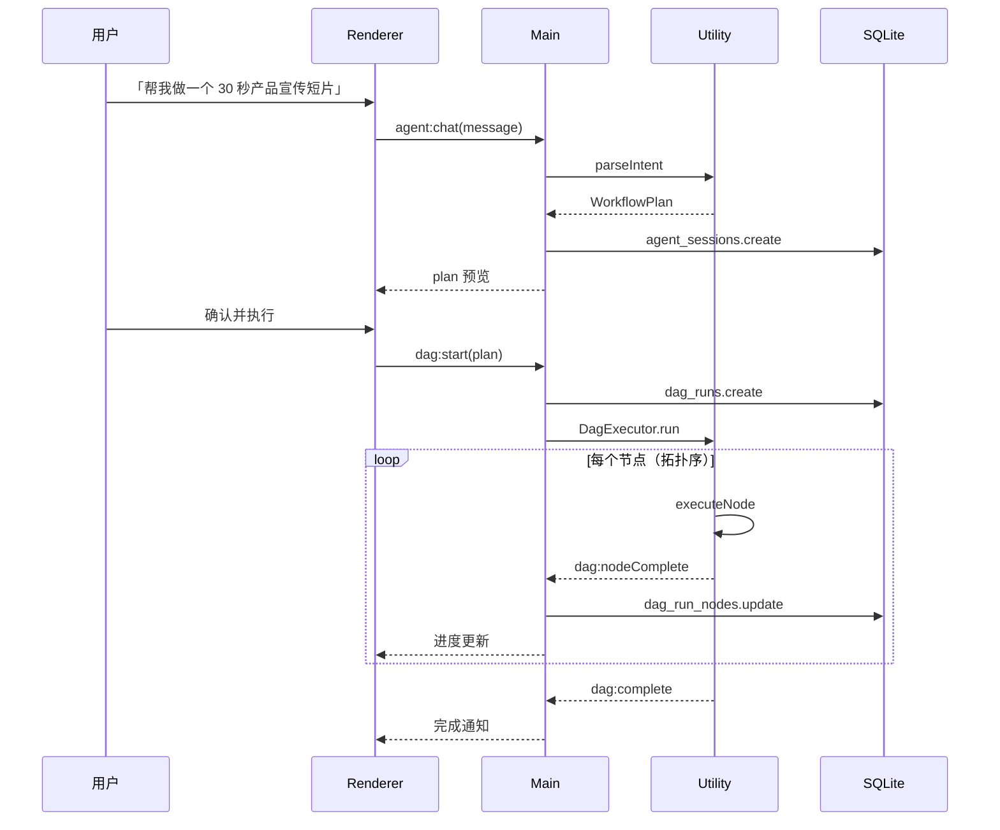

# LocalCanvas v5 — Agent 自动化 + 分镜增强 + 后期工具

> **版本目标**：从「手动节点编排」升级为「意图驱动创作」—— Agent 一句话生成工作流、DAG 整组执行、分镜组专业化、Slash 快捷指令、音频后期能力；并引入**本地用户系统**（为 v6 云端迁移预埋）  
> **预计周期**：3.5 周（17 个工作日）  
> **前置条件**：v4 验收通过（已发布 Windows/macOS 安装包）  
> **生成日期**：2026-06-05

---

## 零、版本定位

v1–v4 完成了 **可发布的本地 AI 视频创作工具**：画布、生成器、合成、历史、工作流模板、打包发布。

v5 是 **发布后第一个能力跃迁版本**，聚焦三条用户价值：

| 痛点（v4 现状） | v5 解法 |
|----------------|---------|
| 新手不会搭节点、连线复杂 | **Agent 模式**：自然语言描述意图 → 自动编排节点并执行 |
| 工作流只能保存/加载，不能一键跑通 | **DAG 执行引擎**：打组/工作流按拓扑序自动执行，支持断点续跑 |
| 脚本分镜散落在多个图片节点，难管理 | **分镜组节点 + 宫格预览**：统一管理、批量重生成、一键导出 |
| 后期需切换外部工具 | **音频后期**：人声分离、简单字幕叠加（FFmpeg / API 可选） |
| v4 无账号，多用户/换机数据难隔离 | **本地用户系统**：注册/登录/资料/数据按用户隔离（SQLite 暂存，v6 迁云端） |

> **刻意不做（留给 v6）**：导演台 3D 场景、云端服务端、数据云同步、移动端预览——技术栈与周期不适合与 v5 并行。  
> **v5 用户系统定位**：常规账号能力（注册、登录、登出、资料、偏好），**数据仅存本地 SQLite**，接口与表结构预留 `sync_status` / `cloud_user_id`，便于 v6 对接独立服务端。

---

## 一、版本功能清单

| # | 功能模块 | 子功能 | 优先级 | 依赖 |
|---|----------|--------|--------|------|
| 1 | Agent 模式 | Agent 侧边栏 + 对话 UI | P0 | v2 LLM 适配器 |
| 2 | Agent 模式 | 意图解析 → 工作流计划（JSON Schema） | P0 | #1 |
| 3 | Agent 模式 | 计划落画布（创建节点 + 连线） | P0 | #2, v1 画布 |
| 4 | Agent 模式 | 计划确认后触发 DAG 执行 | P0 | #3, #10 |
| 5 | Agent 模式 | Skill 插件接口（本地 TS 模块） | P1 | #2 |
| 6 | Agent 模式 | 预置 Skill：文生视频 / 脚本成片 / 首尾帧 | P1 | #5 |
| 7 | Slash 指令 | 画布 `/` 命令面板 | P0 | v1 画布 |
| 8 | Slash 指令 | `/grid 3x3` 九宫格分镜布局 | P1 | #7, #15 |
| 9 | Slash 指令 | `/grid 5x5` 二十五宫格布局 | P2 | #8 |
| 10 | DAG 执行 | 拓扑排序 + 端口数据传递 | P0 | v1 连线规则 |
| 11 | DAG 执行 | 并发控制（尊重 `max_concurrent_tasks`） | P0 | #10, v2 TaskQueue |
| 12 | DAG 执行 | 单步执行 / 从节点继续 | P1 | #10 |
| 13 | DAG 执行 | 执行进度面板（组级 + 节点级） | P0 | #10 |
| 14 | DAG 执行 | 失败节点重试 / 跳过 | P1 | #10, v4 RetryManager |
| 15 | 分镜组 | 分镜组节点类型 | P0 | v2 ScriptNode |
| 16 | 分镜组 | 从脚本节点一键转为分镜组 | P0 | #15 |
| 17 | 分镜组 | 宫格预览（3×3 / 5×5 切换） | P1 | #15 |
| 18 | 分镜组 | 批量选中重生成（图/视频） | P0 | #15, v2 batch-generator |
| 19 | 分镜组 | 分镜板导出（PNG 拼图 / PDF） | P1 | #17 |
| 20 | 分镜组 | 4K 单帧导出 | P2 | #18 |
| 21 | 音频后期 | 人声分离（Demucs API / 本地 CLI 可选） | P1 | v3 FFmpeg |
| 22 | 音频后期 | 分离结果回写音频节点 | P1 | #21 |
| 23 | 字幕 | SRT 导入 + 时间轴叠加预览 | P1 | v3 Timeline |
| 24 | 字幕 | FFmpeg 硬字幕烧录导出 | P2 | #23 |
| 25 | 风格模板 | 提示词风格包（JSON 预设） | P2 | v2 生成器 |
| 26 | 数据层 | `agent_sessions` 表（对话 + 计划存档） | P1 | v4 SQLite |
| 27 | 数据层 | `dag_runs` 表（执行记录 + 断点） | P0 | v4 task_queue |
| 28 | i18n | Agent / DAG / 分镜组文案补全 | P1 | v4 i18n |
| 29 | 用户系统 | 本地注册（用户名 + 密码） | P0 | v4 SQLite |
| 30 | 用户系统 | 本地登录 / 登出 / 会话保持 | P0 | #29 |
| 31 | 用户系统 | 密码 bcrypt 哈希 + 会话 token | P0 | #30 |
| 32 | 用户系统 | 用户资料（昵称、头像、偏好设置） | P1 | #30 |
| 33 | 用户系统 | 业务数据按 `user_id` 隔离 | P0 | #30, v4 Repository |
| 34 | 用户系统 | 游客模式（未登录可继续用，首次引导注册） | P1 | #30 |
| 35 | 用户系统 | v6 迁移预留（`sync_status` / `cloud_user_id`） | P1 | #33 |
| 36 | 测试 | Agent 计划解析单测 | P0 | #2 |
| 37 | 测试 | DAG 拓扑排序 + 执行 E2E | P0 | #10 |
| 38 | 测试 | 用户注册/登录/数据隔离单测 | P0 | #33 |

---

## 二、技术架构（v5 新增）

```
┌──────────────────────────────────────────────────────────────────────┐
│ Main Process                                                          │
│                                                                       │
│ ├── IPC 新增                                                          │
│ │   ├── auth:*         → Main（注册/登录/登出，纯本地）              │
│ │   ├── user:*         → Main（资料读写、偏好设置）                    │
│ │   ├── agent:*        → Utility（LLM 推理 + Skill 执行）            │
│ │   ├── dag:*          → Utility（DAG 调度，状态写 SQLite）            │
│ │   ├── storyboard:*   → Main（分镜组 CRUD + 导出路径）              │
│ │   └── audio:*        → Utility（人声分离 / FFmpeg）                │
│ │                                                                     │
│ ├── SQLite 扩展（IRepository<T>）                                       │
│ │   ├── UserRepository           (users + user_sessions)             │
│ │   ├── AgentSessionRepository   (agent_sessions)                    │
│ │   ├── DagRunRepository         (dag_runs + dag_run_nodes)          │
│ │   └── StoryboardRepository     (storyboard_groups)                 │
│ │                                                                     │
│ ├── AuthService（主进程）                                              │
│ │   ├── register / login / logout                                    │
│ │   ├── bcrypt 密码校验 + 本地 session token                         │
│ │   └── getCurrentUser() — 全局请求注入 user_id                      │
│ │                                                                     │
│ └── 执行协调                                                          │
│     ├── DagOrchestrator（主进程：状态机 + IPC 转发）                   │
│     └── 崩溃恢复：dag_runs.status='running' → pending（同 task_queue）│
│                                                                       │
│ ┌────────────────────────────────────────────────────────────────────┐│
│ │ Utility Process（v5 扩展）                                          ││
│ │                                                                     ││
│ │ ├── AgentService                                                    ││
│ │ │   ├── parseIntent(userMessage) → WorkflowPlan                    ││
│ │ │   ├── invokeSkill(skillId, context)                              ││
│ │ │   └── 复用 RemoteApiAdapter 调用 LLM                             ││
│ │ │                                                                   ││
│ │ ├── DagExecutor                                                     ││
│ │ │   ├── topologicalSort(nodes, edges)                              ││
│ │ │   ├── executeNode(node) → 调用既有 model:* / compose:*           ││
│ │ │   ├── propagateOutputs(edge) — 端口数据写回节点 data             ││
│ │ │   └── emit dag:progress / dag:nodeComplete                       ││
│ │ │                                                                   ││
│ │ ├── AudioPostService                                                ││
│ │ │   ├── separateVocals(filePath) — Demucs CLI 或 HTTP API          ││
│ │ │   └── 输出 vocals.wav + instrumental.wav                         ││
│ │ │                                                                   ││
│ │ └── StoryboardExportService（拼图 / PDF，Sharp + pdfkit）          ││
│ └────────────────────────────────────────────────────────────────────┘│
│                                                                       │
│ ┌────────────────────────────────────────────────────────────────────┐│
│ │ Renderer Process（v5 新增）                                         ││
│ │                                                                     ││
│ │ ├── <AgentPanel>           右侧 Agent 对话 + 计划预览               ││
│ │ ├── <WorkflowPlanPreview>  节点树预览 + 确认/修改                   ││
│ │ ├── <SlashCommandPalette>  画布 `/` 浮层                           ││
│ │ ├── <DagRunPanel>          底部执行进度（组/节点/耗时）             ││
│ │ ├── <StoryboardGroupNode>  分镜组节点 + 宫格视图                    ││
│ │ ├── <StoryboardGridView>   3×3 / 5×5 预览                          ││
│ │ ├── <SubtitleTrack>        时间轴字幕轨（扩展 Timeline）            ││
│ │ ├── <AuthGate>             启动登录/注册（可跳过游客模式）          ││
│ │ ├── <UserProfilePanel>     用户资料与账号设置                       ││
│ │ └── <AccountMenu>          顶栏头像菜单（登出、切换账号）           ││
│ └────────────────────────────────────────────────────────────────────┘│
└──────────────────────────────────────────────────────────────────────┘
```

### 2.1 本地用户系统与 v6 云端边界

| 能力 | v5（本地暂存） | v6（独立服务端） |
|------|----------------|------------------|
| 注册/登录 | SQLite `users` 表，无网络 | REST API + JWT，服务端 Postgres |
| 密码 | bcrypt 存本地 | 服务端 bcrypt + 可选 OAuth |
| 会话 | 本地 `user_sessions` token | HttpOnly Cookie / Refresh Token |
| 项目/历史 | `user_id` 外键隔离 | 云存储 + 增量同步 |
| 头像 | 本地文件路径 | 对象存储 URL |
| 迁移 | `sync_status='local'` | 一键「迁移到云端」向导 |

### 2.2 核心类型（`src/types/agent.ts`）

```typescript
/** Agent 输出的可执行计划 */
export interface WorkflowPlan {
  version: 1
  intent: string
  summary: string
  nodes: PlannedNode[]
  edges: PlannedEdge[]
  executionMode: 'manual' | 'auto'
  estimatedSteps: number
}

export interface PlannedNode {
  tempId: string
  type: 'text' | 'image' | 'video' | 'audio' | 'script' | 'compose' | 'storyboard'
  label?: string
  data: Record<string, unknown>
  modelHint?: string
}

export interface PlannedEdge {
  source: string
  sourceHandle: string
  target: string
  targetHandle: string
}

/** DAG 执行状态 */
export interface DagRun {
  id: string
  projectId: string
  groupId?: string
  status: 'pending' | 'running' | 'paused' | 'completed' | 'failed' | 'cancelled'
  totalNodes: number
  completedNodes: number
  currentNodeId?: string
  error?: string
  createdAt: string
  updatedAt: string
}
```

### 2.3 Agent 与 DAG 协作流程



---

## 三、详细开发步骤

### Week 1（Day 1–5）：本地用户系统 + DAG 执行引擎

#### Day 1 上午：本地用户系统

**文件**：
- `electron/main/services/auth-service.ts`
- `electron/main/repositories/user-repository.ts`
- `electron/main/ipc/auth.ts`
- `src/components/auth/AuthGate.tsx`
- `src/components/auth/RegisterForm.tsx` / `LoginForm.tsx`
- `src/stores/userStore.ts`

**要点**：
- 用户名唯一、密码 ≥ 8 位；`bcrypt` 哈希，禁止明文落库
- 登录成功写入 `user_sessions`（token 哈希 + 过期时间），`electron-store` 仅存 `sessionId`（不存密码）
- 所有 Repository 查询默认带 `user_id`（`projects` / `generations` / `workflows` / `agent_sessions` 等迁移加列）
- v4 升级：已有数据归入「默认本地用户」或游客，首次启动提示创建账号并迁移
- 表字段预留：`users.sync_status`（`local` | `pending` | `synced`）、`users.cloud_user_id`（v6 填入）

**验收**：注册 → 登录 → 创建项目 → 登出 → 换账号仅看到自己的项目

---

#### Day 1 下午 – Day 2：DAG 核心

**文件**：
- `electron/utility/services/dag/topological-sort.ts`
- `electron/utility/services/dag/executor.ts`
- `electron/main/repositories/dag-run-repository.ts`

**要点**：
- 复用 v1 端口连线规则校验（`prompt` → `image.prompt` 等）
- 节点 `data` 在执行前合并上游输出（与手动连线行为一致）
- 每个节点执行映射到既有 IPC：`model:generateImage` / `model:generateVideo` / `compose:start` 等
- `dag_runs` + `dag_run_nodes` 表记录断点，`status='running'` 启动时恢复

**验收**：框选 文本→图片→视频 三节点 → 点击「整组执行」→ 自动按序生成

---

#### Day 3：执行进度 UI + 用户资料 + 组右键菜单

**文件**：
- `src/components/panels/DagRunPanel.tsx`
- `src/hooks/useDagRun.ts`
- `src/components/panels/UserProfilePanel.tsx`
- `src/components/common/AccountMenu.tsx`
- `src/components/canvas/ContextMenu.tsx`（新增「整组执行」「执行到此节点」）

**验收**：底部面板显示节点级进度；失败节点可「重试」或「跳过」；设置页可改昵称/头像

---

#### Day 4：Slash 命令面板

**文件**：
- `src/components/canvas/SlashCommandPalette.tsx`
- `src/utils/slashCommands.ts`

**内置命令**：

| 命令 | 作用 |
|------|------|
| `/run` | 对当前选区启动 DAG |
| `/grid 3x3` | 将选中分镜组切换为九宫格布局 |
| `/grid 5x5` | 二十五宫格 |
| `/agent` | 打开 Agent 面板并聚焦输入框 |
| `/export storyboard` | 导出当前分镜组拼图 |
| `/style` | 打开风格模板选择器 |

**验收**：画布按 `/` 弹出命令列表，模糊搜索，Enter 执行

---

#### Day 5：并发控制 + 崩溃恢复

**文件**：
- `electron/utility/services/dag/concurrency.ts`（复用 v2 `max_concurrent_tasks`）
- `electron/utility/services/dag/recovery.ts`

**策略**：
- 同层节点可并行（如批量分镜图）；有依赖的严格拓扑序
- 与 `task_queue` 共用重试策略（v4 RetryManager）
- 应用启动时：`dag_runs.status='running'` → `paused`，提示用户「是否继续上次执行」

**验收**：10 个分镜批量生成不超限流；杀进程重启后可恢复 DAG

---

### Week 2（Day 6–10）：Agent 模式 + 分镜组

#### Day 6–7：Agent 对话与计划生成

**文件**：
- `electron/utility/services/agent/agent-service.ts`
- `electron/utility/services/agent/prompts/workflow-planner.ts`
- `src/components/panels/AgentPanel.tsx`
- `src/components/panels/WorkflowPlanPreview.tsx`

**LLM System Prompt 约束**（输出严格 JSON）：

```json
{
  "summary": "将创建脚本节点生成分镜，再批量出图、出视频，最后合成",
  "nodes": [
    { "tempId": "script-1", "type": "script", "data": { "synopsis": "..." } },
    { "tempId": "compose-1", "type": "compose", "data": {} }
  ],
  "edges": [],
  "executionMode": "auto"
}
```

**计划落画布**：
- `tempId` → 真实 `nodeId`（uuid）映射表
- 节点按网格自动排版（避免重叠）
- 用户可在预览阶段拖拽调整后再确认

**验收**：输入「做一个咖啡品牌 15 秒广告」→ 生成可执行计划 → 确认后落画布

---

#### Day 8：Skill 插件接口

**文件**：
- `electron/utility/services/agent/skills/index.ts`
- `electron/utility/services/agent/skills/text-to-video.ts`
- `electron/utility/services/agent/skills/script-to-film.ts`

```typescript
export interface AgentSkill {
  id: string
  name: string
  description: string
  /** 匹配用户意图的关键词（本地快速路由，可选） */
  triggers?: string[]
  /** 生成 WorkflowPlan 或扩展现有 plan */
  buildPlan(context: SkillContext): Promise<WorkflowPlan>
}
```

**预置 Skill**：
1. `text-to-video` — 文本 → 图 → 视频
2. `script-to-film` — 脚本 → 分镜 → 批量 → 合成
3. `first-last-frame` — 首尾帧过渡视频

**验收**：Agent 根据意图自动选择 Skill；设置页可禁用 Skill

---

#### Day 9–10：分镜组节点

**文件**：
- `src/components/nodes/StoryboardGroupNode.tsx`
- `src/components/panels/StoryboardGridView.tsx`
- `electron/main/repositories/storyboard-repository.ts`
- `src/hooks/useStoryboardGroup.ts`

**分镜组 vs 脚本节点**：

| 维度 | 脚本节点 (v2) | 分镜组 (v5) |
|------|--------------|-------------|
| 定位 | 生成入口 | 生成结果管理 |
| 数据结构 | `ScriptRow[]` 表格 | `StoryboardFrame[]` 含缩略图/视频引用 |
| 视图 | 表格 | 表格 + 宫格 |
| 批量操作 | 全部重生成 | 勾选帧重生成 |
| 导出 | 无 | 拼图 / PDF / 4K 单帧 |

**`StoryboardFrame` 结构**：

```typescript
export interface StoryboardFrame {
  id: string
  sequence: number
  description: string
  prompt: string
  duration: number
  camera?: string
  imageNodeId?: string
  videoNodeId?: string
  imagePath?: string
  videoPath?: string
  status: 'empty' | 'image' | 'video' | 'failed'
}
```

**与脚本节点联动**：
- 脚本节点右键「转为分镜组」→ 创建 `storyboard` 节点并迁移行数据
- ~~分镜组「同步到画布」→ 为每帧创建/更新关联图片/视频节点~~ **待实现**

**验收**：脚本批量生成后转分镜组；宫格预览；勾选 3 帧重生成图片

---

### Week 3（Day 11–15）：后期工具 + 打磨发布

#### Day 11：分镜导出

**文件**：
- `electron/utility/services/storyboard-export.ts`

**导出格式**：
- `storyboard.png` — 带序号与描述文字的拼图
- `storyboard.pdf` — 打印分镜表
- `frame-{n}-4k.png` — 单帧高清（可选超分 API，无则原图）

**验收**：分镜组导出 PNG/PDF，文件可在系统文件夹打开

---

#### Day 12：人声分离

**文件**：
- `electron/utility/services/audio/vocal-separator.ts`
- `src/components/panels/AudioGenerator.tsx`（新增「分离人声」）

**实现路径**（可配置）：

| 模式 | 说明 |
|------|------|
| API | 自定义 HTTP 适配器调用云端分离服务 |
| CLI | 检测本地 `demucs` 命令，Utility Process spawn |
| 跳过 | 未配置时按钮置灰 + 引导文档 |

**验收**：音频节点分离后生成两个子节点（人声 / 伴奏）

---

#### Day 13：字幕轨

**文件**：
- `src/components/timeline/SubtitleTrack.tsx`
- `electron/utility/services/ffmpeg-subtitle.ts`

**范围**：
- 导入 `.srt` → 解析为 `SubtitleCue[]`
- 时间轴叠加预览（Canvas 或 CSS 叠加）
- 导出时可选 FFmpeg `subtitles` 滤镜烧录

**验收**：导入 SRT 后预览对齐；合成导出带硬字幕 MP4

---

#### Day 14：风格模板 + i18n + 文档

**文件**：
- `src/constants/stylePresets.ts`
- `docs/agent-guide.md`（新增）
- `src/i18n/zh-CN.json` / `en-US.json`（补 Agent/DAG/分镜键）

**风格模板示例**：电影感、动漫、产品广告、纪录片……（仅提示词前缀 + 负向词 + 推荐模型）

**验收**：生成器可一键套用风格；中英文切换无硬编码遗漏

---

#### Day 15：测试 + 验收

| 类型 | 范围 |
|------|------|
| 单测 | `topologicalSort`、`parseWorkflowPlan`、`slashCommands`、`auth-service` |
| 集成 | Agent plan → 落画布 → DAG 执行（mock LLM） |
| 集成 | 双用户数据隔离（同机不同账号项目不可见） |
| E2E | 注册登录 → 脚本 → 分镜组 → 导出拼图 |
| 手工 | 人声分离、字幕烧录各 1 条路径 |

---

## 四、数据库扩展

```sql
-- 本地用户（v6 迁移至云端前暂存）
CREATE TABLE IF NOT EXISTS users (
  id TEXT PRIMARY KEY,
  username TEXT NOT NULL UNIQUE,
  email TEXT,
  password_hash TEXT NOT NULL,
  display_name TEXT,
  avatar_path TEXT,
  preferences TEXT,              -- JSON: 主题、语言、Agent 默认模型等
  sync_status TEXT NOT NULL DEFAULT 'local',  -- local | pending | synced
  cloud_user_id TEXT,            -- v6 云端用户 ID，v5 恒为 NULL
  created_at TEXT NOT NULL DEFAULT (datetime('now')),
  updated_at TEXT NOT NULL DEFAULT (datetime('now'))
);

CREATE TABLE IF NOT EXISTS user_sessions (
  id TEXT PRIMARY KEY,
  user_id TEXT NOT NULL,
  token_hash TEXT NOT NULL,
  expires_at TEXT NOT NULL,
  created_at TEXT NOT NULL DEFAULT (datetime('now')),
  FOREIGN KEY (user_id) REFERENCES users(id) ON DELETE CASCADE
);

CREATE INDEX IF NOT EXISTS idx_user_sessions_user ON user_sessions(user_id);

-- v4 表扩展：业务数据按用户隔离（migration 脚本为既有行补 default user_id）
-- ALTER TABLE projects ADD COLUMN user_id TEXT;
-- ALTER TABLE generations ADD COLUMN user_id TEXT;
-- ALTER TABLE workflows ADD COLUMN user_id TEXT;
-- ... 其余业务表同理

-- Agent 对话存档
CREATE TABLE IF NOT EXISTS agent_sessions (
  id TEXT PRIMARY KEY,
  user_id TEXT NOT NULL,
  project_id TEXT,
  title TEXT,
  messages TEXT NOT NULL,        -- JSON: { role, content, plan? }[]
  last_plan TEXT,                -- JSON WorkflowPlan
  created_at TEXT NOT NULL DEFAULT (datetime('now')),
  updated_at TEXT NOT NULL DEFAULT (datetime('now'))
);

-- DAG 执行记录
CREATE TABLE IF NOT EXISTS dag_runs (
  id TEXT PRIMARY KEY,
  user_id TEXT NOT NULL,
  project_id TEXT NOT NULL,
  group_id TEXT,
  status TEXT NOT NULL DEFAULT 'pending',
  total_nodes INTEGER NOT NULL,
  completed_nodes INTEGER DEFAULT 0,
  current_node_id TEXT,
  snapshot TEXT NOT NULL,        -- JSON: nodes + edges 执行快照
  error TEXT,
  created_at TEXT NOT NULL DEFAULT (datetime('now')),
  updated_at TEXT NOT NULL DEFAULT (datetime('now'))
);

CREATE TABLE IF NOT EXISTS dag_run_nodes (
  id TEXT PRIMARY KEY,
  dag_run_id TEXT NOT NULL,
  node_id TEXT NOT NULL,
  status TEXT NOT NULL DEFAULT 'pending',
  started_at TEXT,
  completed_at TEXT,
  error TEXT,
  output TEXT,                   -- JSON
  FOREIGN KEY (dag_run_id) REFERENCES dag_runs(id)
);

-- 分镜组持久化（可选，也可仅存于项目 canvas_data）
CREATE TABLE IF NOT EXISTS storyboard_groups (
  id TEXT PRIMARY KEY,
  user_id TEXT NOT NULL,
  project_id TEXT NOT NULL,
  name TEXT NOT NULL,
  frames TEXT NOT NULL,          -- JSON StoryboardFrame[]
  layout TEXT DEFAULT 'list',    -- list | grid3 | grid5
  created_at TEXT NOT NULL DEFAULT (datetime('now')),
  updated_at TEXT NOT NULL DEFAULT (datetime('now'))
);

CREATE INDEX IF NOT EXISTS idx_dag_runs_status ON dag_runs(status);
CREATE INDEX IF NOT EXISTS idx_dag_runs_project ON dag_runs(project_id);
```

---

## 五、IPC 通道扩展

| Channel | 方向 | 说明 |
|---------|------|------|
| `auth:register` | R→M | 本地注册，返回 `{ user, session }` |
| `auth:login` | R→M | 本地登录 |
| `auth:logout` | R→M | 销毁会话 |
| `auth:getSession` | R→M | 启动时恢复登录态 |
| `user:getProfile` / `user:updateProfile` | R→M | 资料与偏好 |
| `agent:chat` | R→M→U | 发送消息，返回 `{ reply, plan? }` |
| `agent:applyPlan` | R→M | 将 WorkflowPlan 实例化到画布 |
| `agent:listSessions` | R→M | 列出历史对话 |
| `dag:start` | R→M→U | 对选区/计划启动执行 |
| `dag:pause` / `dag:resume` / `dag:cancel` | R→M→U | 执行控制 |
| `dag:getRun` | R→M | 查询执行状态 |
| `storyboard:export` | R→M→U | 导出拼图/PDF |
| `storyboard:regenerateFrames` | R→M→U | 勾选帧批量重生成 |
| `audio:separateVocals` | R→M→U | 人声分离 |
| `subtitle:import` | R→M | 解析 SRT |
| `subtitle:burn` | R→M→U | 烧录字幕导出 |

事件推送：`dag:progress`、`dag:nodeComplete`、`dag:complete`、`agent:planReady`

---

## 六、用户体验要点

### 6.1 Agent 面板交互

```
┌─────────────────────────────────────┐
│ Agent                          [−][×]│
├─────────────────────────────────────┤
│ 🤖 你好，描述你想做的视频，我来搭工作流 │
│                                     │
│ 👤 做一个科技产品 20 秒宣传片          │
│                                     │
│ 🤖 计划摘要：                        │
│    1. 脚本节点 — 产品卖点分镜          │
│    2. 批量图片 × 6                   │
│    3. 批量视频 × 6                   │
│    4. 合成导出                       │
│    [预览画布布局]  [修改]  [确认执行]   │
├─────────────────────────────────────┤
│ 输入意图...                   [发送] │
└─────────────────────────────────────┘
```

### 6.2 整组执行入口

| 入口 | 场景 |
|------|------|
| 框选 → 右键「整组执行」 | 手动搭好的工作流 |
| 打组节点工具栏 ▶ 按钮 | 组内一键运行 |
| Agent 确认计划 | 自动执行 |
| `/run` Slash | 键盘流 |

### 6.3 分镜组宫格

- 默认列表视图（与脚本表格一致）
- 切换宫格：每格显示缩略图 + 序号 + 时长
- 拖拽调序同步更新 `sequence` 与合成时间轴顺序

### 6.4 本地账号流程

```
首次启动（v4 升级）
  ├─ 已有项目 → 提示「创建账号以隔离数据」→ 注册后迁移到该用户
  └─ 新安装 → 登录/注册页（可「稍后再说」进入游客模式）

已登录
  ├─ 顶栏显示头像 + 昵称
  ├─ 项目列表 / 历史 / 工作流均 scoped 到 currentUser
  └─ 设置 → 账号：改资料、登出、（v6 预留）「迁移到云端」置灰
```

---

## 七、错误处理矩阵（v5 增量）

| 错误场景 | 错误类型 | 检测方式 | 处理策略 | i18n key |
|----------|----------|----------|----------|----------|
| LLM 计划 JSON 解析失败 | AgentError | `JSON.parse` | 重试 1 次 + 降级为纯文本回复 | `error.agent_plan_parse` |
| DAG 环检测 | DagError | 拓扑排序 | 阻断执行，高亮环路节点 | `error.dag_cycle` |
| 端口类型不匹配 | DagError | 连线校验 | 跳过该边 + 警告 | `error.dag_port_mismatch` |
| 节点执行超时 | AdapterError | 继承 v4 | 标记 failed，可单节点重试 | `error.dag_node_timeout` |
| Demucs 未安装 | AppError | CLI 检测 | 引导安装文档 | `error.demucs_missing` |
| SRT 时间轴越界 | AppError | 解析校验 | 拒绝导入 + 行号提示 | `error.subtitle_invalid` |
| 分镜导出磁盘不足 | AppError | v4 disk-space | 阻断导出 | `error.disk_full` |
| 用户名已存在 | AuthError | UNIQUE 约束 | 提示更换用户名 | `error.auth_username_taken` |
| 密码错误 | AuthError | bcrypt 校验失败 | 不清除输入，提示重试 | `error.auth_invalid_credentials` |
| 会话过期 | AuthError | token 过期 | 跳转登录页，保留画布未保存提示 | `error.auth_session_expired` |

---

## 八、v5 验收标准

### 用户系统
- [ ] 本地注册 / 登录 / 登出可用，密码 bcrypt 存储
- [ ] 项目、历史、工作流、Agent 会话按 `user_id` 隔离
- [ ] 游客模式可跳过注册，升级 v4 数据可迁移到首个账号
- [ ] `sync_status` / `cloud_user_id` 字段就绪，v6 无需改表结构

### 核心功能
- [ ] Agent 输入意图 → 生成 WorkflowPlan → 预览 → 落画布
- [ ] 至少 3 个预置 Skill 可用
- [ ] 框选/打组可「整组执行」，拓扑序正确
- [ ] DAG 执行进度面板实时更新
- [ ] 失败节点可重试或跳过
- [ ] Slash `/` 命令面板可用
- [ ] 分镜组节点：宫格预览、勾选重生成、导出拼图
- [ ] 脚本节点可转为分镜组

### 架构要求
- [ ] AuthService 在主进程；认证逻辑不依赖网络
- [ ] Agent 推理与 DAG 执行在 Utility Process，不阻塞主进程
- [ ] `users` / `dag_runs` / `agent_sessions` 通过 IRepository 访问
- [ ] DAG 崩溃恢复与 task_queue 策略一致
- [ ] 新增 IPC 均有 preload 类型定义（`src/types/ipc.ts`）

### 后期能力
- [ ] 人声分离至少一种路径可用（API 或 CLI）
- [ ] SRT 导入 + 预览；可选烧录导出

### 质量
- [ ] Agent 计划解析单测 ≥ 10 例
- [ ] DAG 拓扑排序单测含环检测
- [ ] E2E：Agent 冒烟 + 分镜组导出
- [ ] Agent/DAG/分镜相关 UI 无硬编码中文

---

## 九、发布检查清单（v5 增量）

- [ ] CHANGELOG.md 记录 v5 特性
- [ ] `docs/agent-guide.md` 上线
- [ ] 设置页新增：Agent 默认模型、Demucs 路径、人声分离 API
- [ ] 预置 Skill 可在设置中开关
- [ ] 升级后数据库 migration 自动执行（v4 → v5 新表 + `user_id` 列）
- [ ] 从 v4 项目文件打开，画布数据无损坏，可绑定到本地账号
- [ ] `docs/account-guide.md` 说明本地账号与 v6 云端迁移预期

---

## 十、版本总览

| 版本 | 核心能力 | 周期 | 文档 |
|------|----------|------|------|
| **v1** | 画布 + 5 种节点 + 连线 + 项目存取 | 2 周 | [v1](../../LocalCanvas_v1_画布基础与节点系统.md) |
| **v2** | 模型配置 + 生成器 + 脚本节点 | 2.5 周 | [v2](../../LocalCanvas_v2_模型配置与生成器系统.md) |
| **v3** | 视频合成 + 时间轴 + 项目打磨 | 2.5 周 | [v3](../../LocalCanvas_v3_视频合成与项目打磨.md) |
| **v4** | 高级适配器 + 历史/工作流 + 发布 | 2 周 | [v4](../../LocalCanvas_v4_完善高级功能与发布.md) |
| **v5** | Agent + DAG + 分镜组 + 后期 + 本地用户系统 | 3.5 周 | 本文档 |
| **v6 客户端** | 合成剪辑台 + 文本双栏 + 模型能力 Registry | 2.5 周 | [v6](../../LocalCanvas_v6_节点体验与能力系统.md) |
| **v6 云端扩展** | 云端服务端 + 账号迁移 + 导演台 + 协作 | 规划 | §十一 |
| **全路线图** | Phase 1–6 开发步骤 | — | [开发步骤表](./LocalCanvas_开发步骤表.md) |
| **总计（至 v6 客户端）** | 意图驱动 + 能力驱动画布 | **约 15 周** | — |

---

## 十一、v6 演进方向（预览）

> **客户端 v6 详案**（合成剪辑台 + 文本节点 + 模型能力系统）：见 [LocalCanvas_v6_节点体验与能力系统.md](../../LocalCanvas_v6_节点体验与能力系统.md)。设计原文在 `docs/v6/design/`。  
> 以下 **云端 / 导演台** 等为 v6 **扩展轨道**，与上述客户端 v6 并行规划、分仓库交付。

> v6 除客户端能力外，**需单独构建 LocalCanvas Server**（独立仓库 / 独立部署），负责账号、鉴权、数据同步与多端登录。v5 本地用户数据通过迁移向导上传至服务端。

| 方向 | 说明 | 优先级 |
|------|------|--------|
| **云端服务端** | 独立后端：注册/登录 API、JWT、用户资料、对象存储、同步接口 | P0 |
| **账号与数据迁移** | v5 本地 `users` / 项目 / 历史一键迁云端；`sync_status` 状态机 | P0 |
| 导演台 | 3D 场景搭建 + 角色布局 + 摄像机路径 | P1 |
| 字幕擦除 | 视频字幕 AI 擦除 | P2 |
| 协作 | 多人项目、版本分支（依赖云端项目模型） | P2 |
| 移动端预览 | 局域网 / 云端链接预览成片 | P3 |

### 11.1 v6 服务端概要架构（规划）

```
localcanvas-server/          # 独立 monorepo 或仓库
├── api/                   # REST / WebSocket（Node.js + Fastify 或 NestJS）
│   ├── auth/              # 注册、登录、刷新 token
│   ├── users/             # 资料、偏好
│   ├── projects/          # 项目元数据 + 画布 JSON 同步
│   ├── assets/            # 媒体上传签名 URL
│   └── sync/              # 增量同步（since cursor）
├── db/                    # PostgreSQL（用户与项目主库）
├── storage/               # S3 兼容对象存储（生成物、头像）
└── deploy/                # Docker Compose / K8s 清单
```

**客户端改动（v6）**：
- 设置页「迁移到云端」：导出本地 SQLite 快照 → 调用 `sync/import` → 切换 `AuthService` 为远程模式
- 离线优先保留：云端不可用时回退只读本地缓存（可选 P2）

**明确不做（v6）**：OpenClaw 外部框架集成、社区分享/模板市场、ComfyUI/Ollama 本地模型直连——与产品「远程 API 可配置」路线保持一致，避免范围发散。

---

## 十二、风险与应对

| 风险 | 影响 | 应对 |
|------|------|------|
| LLM 计划不稳定 | 落画布结构错误 | JSON Schema 校验 + 用户确认门；失败降级手动模式 |
| DAG 长时间执行 | 用户焦虑/中断 | 分步进度 + 暂停/恢复；单节点超时独立失败 |
| Demucs 依赖重 | 安装门槛高 | 默认 API 模式；CLI 可选；功能可关闭 |
| 分镜组节点性能 | 25 宫格缩略图卡顿 | 虚拟列表 + 缩略图缓存（复用 v3 thumbnail） |
| Agent 成本 | 用户 LLM 费用 | 计划阶段可切换便宜模型；显示预估 token/步数 |
| 范围膨胀 | 3.5 周无法交付 | 导演台/云端服务坚决不进 v5；用户系统仅本地版 |
| v4 数据迁移复杂 | 升级用户丢项目 | 默认用户 + 显式迁移向导；migration 可回滚 |
| v5/v6 账号模型不一致 | 迁移失败 | v5 预留 `cloud_user_id`；服务端 import API 对齐字段 |

---

## 十三、与 v4 附录演进方向的对照

| v4 附录方向 | v5 处理 |
|-------------|---------|
| Agent 模式（高） | ✅ 核心交付 |
| 导演台（高） | ⏭️ 推迟至 v6 |
| Slash 快捷（中） | ✅ 交付 |
| 分镜组（中） | ✅ 核心交付 |
| 人声分离（中） | ✅ 交付 |
| 字幕擦除（中） | ⏭️ v6（v5 仅 SRT 叠加/烧录） |
| 风格模板库（低） | ✅ 轻量预设 |
| 用户/账号（—） | ✅ v5 本地用户系统 |
| 多语言（低） | 🔶 补全 v5 新 UI 文案 |
| 社区分享（低） | ❌ 不在路线图 |
| 移动端预览（低） | ⏭️ v6 |
| OpenClaw 集成（—） | ❌ 不在路线图 |

---

## 十四、附录 A：测试用例

> 原 `docs/v5-test-cases.md` 已归档至本文（2026-06-08）。  
> **关联**：[agent-guide.md](./agent-guide.md) · 跑表记录规划见 [v10 技术债](../../LocalCanvas_v10_项目优化与技术债归集.md)（`docs/v10-qa-run.md`）  
> **更新日期**：2026-06-05（用例表）；自动化快照 2026-06-08

### A.1 测试范围

#### A.1.1 纳入范围

| 模块 | 说明 |
|------|------|
| 本地用户系统 | 注册、登录、登出、游客、资料、数据隔离、v4 遗留迁移 |
| Agent 模式 | 对话、计划生成、Skill、落画布、会话存档 |
| DAG 执行 | 拓扑排序、整组执行、进度面板、崩溃恢复 |
| Slash 指令 | `/run`、`/agent`、`/grid`、`/export storyboard`、`/style` |
| 分镜组 | 脚本转换、宫格、批量重生、导出 |
| 音频后期 | 人声分离（Demucs / FFmpeg） |
| 字幕 | SRT 导入、预览、硬字幕烧录 |
| 风格模板 | 图像/视频生成器套用预设 |
| 数据层 | SQLite 新表、`user_id` 隔离、migration |
| 发布项 | CHANGELOG、文档、设置页新增项 |

#### A.1.2 不纳入范围（v6）

导演台 3D、云端服务端、字幕 AI 擦除、社区分享、OpenClaw、本地模型直连。

#### A.1.3 测试环境

| 项 | 要求 |
|----|------|
| 操作系统 | Windows 10/11（主）、macOS（可选抽检） |
| 构建 | `npm run build` 通过后启动；E2E 使用 `npm run test:e2e` |
| 前置配置 | 至少 1 个 LLM、1 个图像模型、FFmpeg 可用 |
| 可选 | Demucs CLI 已安装（人声分离高质量路径） |
| 数据 | 准备：空白安装、含 v4 遗留项目、双测试账号 |

#### A.1.4 用例编号规则

```
TC-{类型}-{模块}-{序号}

类型：M=手工  A=自动化单测  I=集成  E=E2E
模块：AUTH AGENT DAG SLASH SB AUDIO SUB STYLE CFG REL
```

#### A.1.5 优先级

| 级别 | 含义 |
|------|------|
| P0 | 阻塞发布，必须通过 |
| P1 | 重要体验，建议发布前通过 |
| P2 | 增强项，可延后 |

### A.2 用户系统（AUTH）

| ID | 优先级 | 标题 | 前置条件 | 步骤 | 预期结果 | 状态 |
|----|--------|------|----------|------|----------|------|
| TC-M-AUTH-001 | P0 | 新用户注册 | 首次启动，未登录 | 1. 打开应用<br>2. 切换注册<br>3. 输入用户名（≥3 字符）、密码（≥8 位）、确认密码<br>4. 提交 | 注册成功，进入主界面；`users` 表有新记录，密码为 bcrypt 哈希 | ⬜ |
| TC-M-AUTH-002 | P0 | 用户名重复 | 已存在用户 `alice` | 1. 注册同名用户 `alice` | 提示用户名已占用，不创建重复记录 | ⬜ |
| TC-M-AUTH-003 | P0 | 登录与登出 | 已有账号 `alice` | 1. 登录<br>2. 创建项目 A<br>3. 顶栏登出<br>4. 再以 `bob` 登录 | 登出后会话清除；`bob` 看不到 `alice` 的项目 A | ⬜ |
| TC-M-AUTH-004 | P0 | 游客模式 | 启动页 | 1. 点击「稍后再说 / 游客模式」 | 进入主界面，`isGuest=true`；可创建项目 | ⬜ |
| TC-M-AUTH-005 | P0 | 双用户数据隔离 | 用户 A、B 各一账号 | 1. A 创建项目并生成历史记录<br>2. 登出，B 登录<br>3. 查看项目列表、历史面板、工作流列表 | B 仅看到自己的数据；A 的项目/历史/自定义工作流不可见 | ⬜ |
| TC-M-AUTH-006 | P1 | v4 遗留数据迁移 | 存在 `user_id` 为空的 v4 项目 | 1. 首次注册或登录<br>2. 查看项目列表 | 遗留项目绑定到当前用户；`claimedLegacyProjects` > 0（注册响应） | ⬜ |
| TC-M-AUTH-007 | P1 | 修改昵称 | 已登录 | 1. 打开账号设置（`UserProfilePanel`）<br>2. 修改 displayName 保存 | 顶栏显示新昵称；`users.display_name` 更新 | ⬜ 待 UI |
| TC-M-AUTH-008 | P1 | 修改头像 | 已登录 | 1. 账号设置中选择本地头像文件<br>2. 保存 | 顶栏显示头像；`users.avatar_path` 有值 | ⬜ 待 UI |
| TC-M-AUTH-009 | P1 | 会话保持 | 已登录 | 1. 登录后关闭应用<br>2. 重新打开 | 自动恢复登录态（`session.json` + `user_sessions`） | ⬜ |
| TC-M-AUTH-010 | P2 | v6 预留字段 | 已登录用户 | 1. 查 SQLite `users` 表 | `sync_status='local'`，`cloud_user_id` 为 NULL | ⬜ |

**自动化**

| ID | 优先级 | 标题 | 命令/文件 | 预期 | 状态 |
|----|--------|------|-----------|------|------|
| TC-A-AUTH-001 | P0 | 密码 bcrypt 哈希 | `electron/main/services/auth-service.test.ts`（待建） | 注册后 `password_hash` 以 `$2` 开头，明文不入库 | ⬜ |
| TC-A-AUTH-002 | P0 | 登录校验失败 | 同上 | 错误密码返回 `AUTH_INVALID_CREDENTIALS`，不创建会话 | ⬜ |
| TC-A-AUTH-003 | P0 | claimLegacyData | 同上 | 无 `user_id` 行数正确迁移到当前用户 | ⬜ |

### A.3 Agent 模式（AGENT）

| ID | 优先级 | 标题 | 前置条件 | 步骤 | 预期结果 | 状态 |
|----|--------|------|----------|------|----------|------|
| TC-M-AGENT-001 | P0 | 打开 Agent 面板 | 已配置 LLM | 1. 侧栏点 Agent 或 `/agent` | Agent 面板打开，可输入消息 | ⬜ |
| TC-M-AGENT-002 | P0 | 意图 → 计划预览 | LLM 可用 | 1. 输入「做一个 15 秒咖啡品牌短片」<br>2. 发送 | 返回文字回复 + `WorkflowPlan` 预览（节点列表） | ⬜ |
| TC-M-AGENT-003 | P0 | 计划落画布 | 有计划预览 | 1. 点击「确认并添加到画布」 | 画布出现对应节点与连线；节点不严重重叠 | ⬜ |
| TC-M-AGENT-004 | P0 | 自动模式触发 DAG | 计划 `executionMode: 'auto'` | 1. 确认计划 | 落画布后自动开始 DAG；底部进度面板出现 | ⬜ |
| TC-M-AGENT-005 | P1 | Skill：文生视频 | 禁用其他 Skill | 1. 输入纯文生视频意图 | 路由到 `text-to-video` Skill，计划含 text→image→video 链路 | ⬜ |
| TC-M-AGENT-006 | P1 | Skill：脚本成片 | — | 1. 输入「根据故事写脚本并出分镜」 | 路由 `script-to-film`，计划含 script/storyboard | ⬜ |
| TC-M-AGENT-007 | P1 | Skill：首尾帧 | — | 1. 输入首尾帧过渡视频意图 | 路由 `first-last-frame` | ⬜ |
| TC-M-AGENT-008 | P1 | 禁用 Skill | 设置页关闭 `script-to-film` | 1. 发送脚本成片类意图 | 不走该 Skill 或降级为通用计划 | ⬜ |
| TC-M-AGENT-009 | P1 | 计划 JSON 非法 | Mock LLM 返回非 JSON | 1. 发送消息 | 不崩溃；提示解析失败或纯文本回复 | ⬜ |
| TC-M-AGENT-010 | P1 | 会话持久化 | 同项目多次对话 | 1. 对话 2 轮<br>2. 查 `agent_sessions` 表 | `messages` JSON 含 user/assistant；`last_plan` 有值 | ⬜ |
| TC-M-AGENT-011 | P2 | 会话历史 UI | 有多条会话 | 1. Agent 面板查看历史列表 | 可按项目切换历史会话 | ⬜ 待 UI |

**自动化**

| ID | 优先级 | 标题 | 文件 | 预期 | 状态 |
|----|--------|------|------|------|------|
| TC-A-AGENT-001 | P0 | 解析最小合法计划 | `parseWorkflowPlan.test.ts` | `nodes/edges/executionMode` 正确 | ✅ |
| TC-A-AGENT-002 | P0 | 从 Markdown 代码块提取 JSON | 同上 | 正确解析 fence 内 JSON | ✅ |
| TC-A-AGENT-003 | P0 | 非法节点类型抛错 | 同上 | `WorkflowPlanParseError` | ✅ |
| TC-A-AGENT-004 | P0 | 缺省字段补全 | 同上（待补充） | 缺 `executionMode` 时默认 `manual` | ⬜ |
| TC-A-AGENT-005 | P0 | 空节点列表 | 同上（待补充） | 拒绝或返回空计划错误 | ⬜ |
| TC-A-AGENT-006~010 | P0 | 边界用例集 | 同上（待补充至 ≥10 例） | 环边、重复 tempId、缺 data 等 | ⬜ |
| TC-I-AGENT-001 | P1 | Mock LLM 落画布 | 集成（待建） | plan → `applyWorkflowPlan` 节点数/边数一致 | ⬜ |

### A.4 DAG 执行（DAG）

| ID | 优先级 | 标题 | 前置条件 | 步骤 | 预期结果 | 状态 |
|----|--------|------|----------|------|----------|------|
| TC-M-DAG-001 | P0 | 三节点拓扑序执行 | 文本→图片→视频已连线配置模型 | 1. 框选三节点<br>2. 右键「整组执行」或 `/run` | 按依赖顺序执行；上游输出流入下游 | ⬜ |
| TC-M-DAG-002 | P0 | 进度面板更新 | 执行中 | 1. 观察 `DagRunPanel` | 节点状态 pending→running→completed；计数递增 | ⬜ |
| TC-M-DAG-003 | P0 | 环路阻断 | 故意连成环 | 1. 整组执行 | 提示存在环路，不开始执行 | ⬜ |
| TC-M-DAG-004 | P0 | 单节点失败停止 | 图片节点无 prompt | 1. 整组执行 | 失败节点标记 failed；后续不执行；DAG 状态 failed | ⬜ |
| TC-M-DAG-005 | P1 | 失败节点重试 | 某节点失败 | 1. 在进度面板点「重试」 | 仅从该节点重新执行 | ⬜ 待 UI |
| TC-M-DAG-006 | P1 | 失败节点跳过 | 某节点失败 | 1. 点「跳过」<br>2. 继续 | 节点标记 skipped；后续节点继续 | ⬜ 待 UI |
| TC-M-DAG-007 | P1 | 执行到此节点 | 5 节点链 | 1. 右键目标节点「执行到此节点」 | 仅执行其上游拓扑链 | ⬜ 待 UI |
| TC-M-DAG-008 | P1 | 崩溃恢复提示 | DAG 执行中断 | 1. 执行中强杀进程<br>2. 重启应用 | `dag_runs.status` 变为 paused；弹窗询问是否继续 | ⬜ 待 UI |
| TC-M-DAG-009 | P1 | 同层并发 | 10 个无依赖图片节点 | 1. 整组执行<br>2. 观察并发 | 同时运行数 ≤ `max_concurrent_tasks` | ⬜ 待实现 |
| TC-M-DAG-010 | P2 | dag_runs 记录 | 完成一次执行 | 1. 查 SQLite | `dag_runs` + `dag_run_nodes` 有完整记录 | ⬜ |

**自动化**

| ID | 优先级 | 标题 | 文件 | 预期 | 状态 |
|----|--------|------|------|------|------|
| TC-A-DAG-001 | P0 | 线性拓扑排序 | `topologicalSort.test.ts` | 顺序正确 | ✅ |
| TC-A-DAG-002 | P0 | 环检测 | 同上 | 抛出 `DagCycleError` | ✅ |
| TC-A-DAG-003 | P0 | 分支合并图 | 同上（待补充） | 多前驱节点排序正确 | ⬜ |
| TC-E-DAG-001 | P1 | 整组执行冒烟 | `e2e/dag-smoke.spec.ts` | Mock 生成完成，进度面板出现 | ✅ |

### A.5 Slash 指令（SLASH）

| ID | 优先级 | 标题 | 步骤 | 预期结果 | 状态 |
|----|--------|------|------|----------|------|
| TC-M-SLASH-001 | P0 | 打开命令面板 | 画布按 `/` | 浮层出现，可输入过滤 | ⬜ |
| TC-M-SLASH-002 | P0 | 模糊搜索 | 输入 `run` | 匹配 `/run` 整组执行 | ⬜ |
| TC-M-SLASH-003 | P0 | `/run` | 选中节点后执行 `/run` | 等同整组执行 | ⬜ |
| TC-M-SLASH-004 | P1 | `/grid 3x3` | 选中分镜组 | layout 变为 `grid3` | ⬜ |
| TC-M-SLASH-005 | P2 | `/grid 5x5` | 选中分镜组 | layout 变为 `grid5` | ⬜ |
| TC-M-SLASH-006 | P1 | `/export storyboard` | 选中有帧的分镜组 | 导出 PNG 并打开输出目录 | ⬜ |
| TC-M-SLASH-007 | P2 | `/style` | 执行命令 | 打开风格选择或聚焦生成器风格下拉 | ⬜ 待完善 |

**自动化**

| ID | 优先级 | 标题 | 文件 | 预期 | 状态 |
|----|--------|------|------|------|------|
| TC-A-SLASH-001 | P1 | 命令列表完整 | `slashCommands.test.ts` | 含 run/agent/export/style | ✅ |
| TC-A-SLASH-002 | P1 | 过滤逻辑 | 同上 | 关键词/描述匹配 | ✅ |

### A.6 分镜组（SB）

| ID | 优先级 | 标题 | 前置条件 | 步骤 | 预期结果 | 状态 |
|----|--------|------|----------|------|----------|------|
| TC-M-SB-001 | P0 | 脚本转分镜组 | 脚本节点有 rows | 1. 右键脚本节点<br>2. 「转为分镜组」 | 新建 storyboard 节点，`frames` 数量与脚本行一致 | ⬜ |
| TC-M-SB-002 | P0 | 宫格切换 | 分镜组有 ≥9 帧 | 1. 切换 list / grid3 / grid5 | 节点内布局相应变化 | ⬜ |
| TC-M-SB-003 | P0 | 勾选批量重生图片 | 已配置图像模型 | 1. 勾选 3 帧<br>2. 「重生成选中帧（图）」 | 选中帧 `imageSrc` 更新；进度正常 | ⬜ |
| TC-M-SB-004 | P1 | 批量重生视频 | 已配置视频模型 | 1. 勾选帧<br>2. 重生视频 | 帧 `videoSrc` 更新 | ⬜ 待实现 |
| TC-M-SB-005 | P1 | 导出 PNG 拼图 | 有帧（含无图占位） | 1. 导出 PNG | `outputs/storyboard.png` 生成，含序号与描述 | ⬜ |
| TC-M-SB-006 | P1 | 导出 PDF | 同上 | 1. 导出 PDF | `outputs/storyboard.pdf` 可打开 | ⬜ |
| TC-M-SB-007 | P2 | 导出 4K 单帧 | 选中 1 帧且有图 | 1. 导出 4K | `frame-{n}-4k.png` 宽度 3840 | ⬜ |
| TC-M-SB-008 | P1 | 同步到画布 | 分镜组有多帧 | 1. 「同步到画布」 | 每帧关联 image/video 子节点 | ⬜ 待实现 |

**自动化**

| ID | 优先级 | 标题 | 文件 | 预期 | 状态 |
|----|--------|------|------|------|------|
| TC-A-SB-001 | P1 | 脚本行转帧 | `storyboardConvert`（待建） | sequence/description/prompt 映射正确 | ⬜ |
| TC-E-SB-001 | P0 | 分镜导出冒烟 | `e2e/storyboard-export.spec.ts` | IPC 返回 outputPath，文件存在 | ✅ |

### A.7 音频后期（AUDIO）

| ID | 优先级 | 标题 | 前置条件 | 步骤 | 预期结果 | 状态 |
|----|--------|------|----------|------|----------|------|
| TC-M-AUDIO-001 | P1 | Demucs 分离 | 配置 demucs_path 或 PATH 有 demucs；音频节点有文件 | 1. 「分离人声」 | 生成 vocals + instrumental；创建两个子音频节点 | ⬜ |
| TC-M-AUDIO-002 | P1 | FFmpeg 回退 | 无 Demucs | 1. 分离人声 | 使用 FFmpeg 简易分离；提示为 fallback 模式 | ⬜ |
| TC-M-AUDIO-003 | P2 | HTTP API 分离 | 配置 vocal_separation_endpoint | 1. 分离人声 | 调用 API 并落盘 | ⬜ 待实现 |
| TC-M-AUDIO-004 | P1 | 无音频时禁用 | 空音频节点 | 1. 查看按钮 | 「分离人声」不可用 | ⬜ |

### A.8 字幕（SUB）

| ID | 优先级 | 标题 | 前置条件 | 步骤 | 预期结果 | 状态 |
|----|--------|------|----------|------|----------|------|
| TC-M-SUB-001 | P1 | 导入 SRT | 合成节点有视频轨 | 1. 「导入 SRT」选文件 | `subtitleCues` 解析成功；显示条数 | ⬜ |
| TC-M-SUB-002 | P1 | 时间轴预览 | 已导入 SRT | 1. 拖动播放指针 | 预览区与字幕轨高亮当前 cue | ⬜ |
| TC-M-SUB-003 | P2 | 硬字幕烧录 | 已导入 + 有视频片段 | 1. 勾选「烧录硬字幕」<br>2. 导出合成 | 输出 MP4 含烧录字幕 | ⬜ |
| TC-M-SUB-004 | P1 | 非法 SRT | 损坏/空文件 | 1. 导入 | 提示解析失败，不写入节点 | ⬜ |

**自动化**

| ID | 优先级 | 标题 | 文件 | 预期 | 状态 |
|----|--------|------|------|------|------|
| TC-A-SUB-001 | P1 | 标准 SRT 解析 | `parseSrt.test.ts` | 时间戳、文本、多行 | ✅ |
| TC-A-SUB-002 | P1 | 播放时间查找 | 同上 | `findCueAtTime` 边界正确 | ✅ |
| TC-A-SUB-003 | P1 | 无序号 SRT | 同上（待补充） | 仍能解析 | ⬜ |

### A.9 风格模板（STYLE）

| ID | 优先级 | 标题 | 步骤 | 预期结果 | 状态 |
|----|--------|------|------|----------|------|
| TC-M-STYLE-001 | P2 | 图像套用电影感 | 1. 图像生成器选「电影感」<br>2. 生成 | 请求 prompt 含 cinematic 前缀；负向词合并 | ⬜ |
| TC-M-STYLE-002 | P2 | 视频套用动漫 | 1. 视频生成器选「动漫」<br>2. 生成 | prompt 含 anime 前缀 | ⬜ |
| TC-M-STYLE-003 | P2 | 切换语言 | 1. 设置 en-US<br>2. 查看风格下拉 | 显示英文名（Cinematic 等） | ⬜ |

### A.10 设置与配置（CFG）

| ID | 优先级 | 标题 | 步骤 | 预期结果 | 状态 |
|----|--------|------|------|----------|------|
| TC-M-CFG-001 | P0 | FFmpeg 检测/下载 | 设置页操作 | 路径写入 config；合成可用 | ⬜ |
| TC-M-CFG-002 | P1 | Demucs 路径 | 填写 demucs_path 保存 | 重启后保留；人声分离优先 Demucs | ⬜ |
| TC-M-CFG-003 | P1 | Agent Skill 开关 | 禁用某 Skill | localStorage + 设置页一致；Agent 生效 | ⬜ |
| TC-M-CFG-004 | P2 | Agent 默认模型 | 设置默认 LLM | Agent 对话使用该模型 | ⬜ 待 UI |
| TC-M-CFG-005 | P2 | 人声分离 API | 填写 endpoint/key | 分离走 API | ⬜ 待 UI |

### A.11 发布与升级（REL）

| ID | 优先级 | 标题 | 步骤 | 预期结果 | 状态 |
|----|--------|------|------|----------|------|
| TC-M-REL-001 | P0 | v4→v5 数据库迁移 | 用 v4 用户数据目录启动 v5 | 自动建表；`user_id` 列存在；旧项目可打开 | ⬜ |
| TC-M-REL-002 | P0 | 画布数据兼容 | 打开 v4 保存的项目 | 节点/连线/资源路径正常 | ⬜ |
| TC-M-REL-003 | P0 | IPC 类型完整 | 抽查 `storyboard`/`audio`/`dag`/`agent` | preload 与 `src/types/ipc.ts` 一致 | ⬜ |
| TC-M-REL-004 | P1 | 文档齐全 | 检查 docs | `agent-guide.md` 存在；`account-guide.md` 待补 | 🔶 |
| TC-M-REL-005 | P1 | CHANGELOG v5 | 打开 CHANGELOG | 记录 v5 新特性 | ⬜ |
| TC-M-REL-006 | P1 | 中英文切换 | 切换 zh-CN / en-US | Agent/DAG/分镜无遗漏硬编码（抽检） | ⬜ |

### A.12 E2E 场景（端到端）

| ID | 优先级 | 场景 | 步骤摘要 | 预期 | 状态 |
|----|--------|------|----------|------|------|
| TC-E-FLOW-001 | P0 | 注册到导出分镜 | 注册 → 新建项目 → 脚本生成 → 转分镜组 → 导出 PNG | 全链路无崩溃，输出文件存在 | ⬜ |
| TC-E-FLOW-002 | P0 | Agent 到 DAG | Agent 描述意图 → 确认计划 → 自动执行 | 节点生成物写入项目 assets | ⬜ |
| TC-E-FLOW-003 | P1 | 合成+字幕 | 视频片段 → 合成节点 → 导入 SRT → 烧录导出 | 输出带硬字幕 MP4 | ⬜ |
| TC-E-FLOW-004 | P1 | 音频分离 | TTS 生成 → 分离人声 → 子节点可播放 | 两个 wav/mp3 可导入项目 | ⬜ |
| TC-E-FLOW-005 | P0 | 双账号隔离 | A/B 交替登录同一机器 | 项目列表互不可见 | ⬜ |

**Playwright 文件（2026-06-08）**

```
e2e/
  app.spec.ts                 # 启动冒烟
  compose-smoke.spec.ts       # 合成映射
  dag-smoke.spec.ts           # DAG 整组执行
  storyboard-export.spec.ts   # 分镜导出
  workbench-smoke.spec.ts     # 工作台三栏
  auth-isolation.spec.ts      # 待建：TC-E-FLOW-005
  agent-dag.spec.ts           # 待建：TC-E-FLOW-002（需 mock LLM）
```

### A.13 测试执行记录模板

```markdown
### 执行批次：v5-rc1 — 2026-__-__

| 模块 | 用例数 | 通过 | 失败 | 阻塞 | 跳过 | 通过率 |
|------|--------|------|------|------|------|--------|
| AUTH | | | | | | |
| AGENT | | | | | | |
| DAG | | | | | | |
| ... | | | | | | |

**失败用例**：
- TC-M-xxx：现象 / 复现步骤 / 关联 issue

**阻塞项**：
- ...

**签字**：测试 __ / 开发 __ / 产品 __
```

### A.14 当前自动化覆盖快照

| 套件 | 命令 | 用例数（约） | 说明 |
|------|------|-------------|------|
| Vitest 单测 | `npm test` | 166 | 38 文件；含 topologicalSort、parseWorkflowPlan、slashCommands、parseSrt、authValidation 等 |
| Playwright E2E | `npm run test:e2e` | 5 文件 | app / compose / dag / storyboard-export / workbench-smoke |
| 待补充单测 | — | — | auth-service 主进程、parseWorkflowPlan 边界、storyboardConvert |
| 待补充 E2E | — | — | auth-isolation、agent-dag（见 A.12） |

### A.15 与未完成功能的映射

> v9 Wave 2 已关闭多项（`UserProfilePanel`、DAG 重试/跳过/执行到此节点、分镜同步画布等）；下表为**原始 v5 缺口对照**，手工跑表前请与代码现状核对。

| 用例 ID | 依赖功能 |
|---------|----------|
| TC-M-AUTH-007/008 | `UserProfilePanel` |
| TC-M-DAG-005~007 | DAG 重试/跳过/执行到此节点 |
| TC-M-DAG-008 | 崩溃恢复确认弹窗 |
| TC-M-DAG-009 | DAG 同层并发 |
| TC-M-SB-004/008 | 分镜批量视频、同步到画布 |
| TC-M-AUDIO-003 | 人声分离 HTTP API |
| TC-M-SLASH-007 | `/style` 独立选择器 |
| TC-M-CFG-004/005 | Agent 默认模型、分离 API 设置 |
| TC-M-AGENT-011 | Agent 会话历史 UI |

用例状态列请在每次测试执行后维护（⬜ 未测 / ✅ 通过 / ❌ 失败 / ⏭ 跳过）。

---

*本文档由 v4 发布后产品推演生成，作为 v5 迭代的需求基线。测试用例见附录 A；跑表记录规划见 [v10 技术债归集](../../LocalCanvas_v10_项目优化与技术债归集.md)。实施过程中若 Agent 效果不达预期，优先保证 DAG + 分镜组 + 本地用户系统交付，Agent 可降为「计划建议 + 手动确认」模式。*
