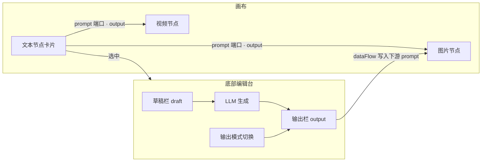

# LocalCanvas 文本节点重设计

> **方案**：B — 单节点双栏 + 显式输出模式  
> **目标**：消除「多入口编辑、多字段重叠、隐式输出规则」带来的混乱，让文本节点职责清晰、下游可预期  
> **原则**：节点看状态、面板做编辑；输入与输出语义固定；连线永远走明确的 `output`  
> **日期**：2026-06-05  
> **状态**：✅ 已实施（v2 文本编辑台）

---

## 一、设计定位

### 1.1 我们是什么 / 不是什么

| 是 | 不是 |
|----|------|
| 画布上的**文案源 / Prompt 源** | 富文本编辑器、Markdown 笔记 |
| 可选 **LLM 改写** 的文本节点 | 脚本分镜表（那是 `script` 节点） |
| 向下游（图/视频）传递**明确的一段文本** | 隐式「生成优先、否则输入」的黑盒 |

### 1.2 两种用法，一个节点

```
用法 A：纯文案源
  写草稿 → 同步到输出 → 连线到图片/视频
  （固定 prompt、剧本片段、产品文案）

用法 B：LLM 改写源
  写草稿 → AI 生成 → 输出栏更新 → 连线到图片/视频
  （润色、扩写、翻译、结构化 prompt）
```

不拆成两种节点类型，通过**显式输出模式**区分行为，降低画布复杂度。

### 1.3 核心用户路径（80% 场景）

```
添加文本节点 → 底部面板写草稿 →（可选）生成 → 确认输出模式 → 连线到图/视频节点
```

### 1.4 设计原则

1. **节点 = 状态卡片**：只预览「当前输出」和模式，不做长文编辑
2. **底部面板 = 唯一编辑区**：选中节点后所有编辑在此完成
3. **草稿与输出分离**：`draft` 给 LLM 用，`output` 给下游用，互不隐式覆盖
4. **输出规则可见**：节点徽章 + 面板模式切换，用户始终知道连线传的是什么
5. **与合成编辑器一致**：画布管连接与状态，面板管深度编辑

---

## 二、现状问题

| 问题 | 表现 | 影响 |
|------|------|------|
| 字段重叠 | `inputContent` / `generatedContent` / `content` / `prompt` 四套字段 | 读写分散，迁移与调试困难 |
| 编辑入口多 | 节点 Tab + 全屏弹窗 + 底部 `TextGenerator` textarea | 改一处不知哪处是「权威」 |
| 生成后覆盖草稿 | `handleGenerate` 同时写 `inputContent` 与 `generatedContent` | 输入/输出边界消失 |
| 隐式输出规则 | `textNodePromptOutput()`：有生成用生成，否则用输入 | 用户不知道连线传的是哪段 |
| 节点内 Tab 混乱 | 「输入」「生成」两 Tab 均可编辑，语义相近 | 认知负担高 |
| 与脚本节点边界模糊 | 文本节点也可贴长文、当分镜用 | 用户不知该用 text 还是 script |

**相关代码（现状）**

| 模块 | 路径 |
|------|------|
| 节点 UI | `src/components/nodes/TextNode.tsx` |
| 底部生成器 | `src/components/panels/TextGenerator.tsx` |
| 全屏编辑弹窗 | `src/components/common/TextEditorModal.tsx` |
| 下游输出逻辑 | `src/utils/dataFlow.ts` → `textNodePromptOutput()` |
| 类型定义 | `src/types/node.ts` → `TextNodeData` |

---

## 三、方案 B 总览

### 3.1 架构关系



### 3.2 与脚本节点的分工

| 维度 | 文本节点 `text` | 脚本节点 `script` |
|------|-----------------|-------------------|
| 数据结构 | 自由长文（draft / output） | 结构化分镜表 `scriptRows` |
| 主要用途 | Prompt、文案、LLM 润色 | 分镜描述、批量出图/出视频 |
| 下游输出 | 单一字符串 `output` | 多行 prompt 拼接或按行驱动 |
| 是否调用 LLM | 可选（改写草稿） | 是（生成分镜表） |

---

## 四、界面设计

### 4.1 画布节点（状态卡片）

选中节点时自动展开底部面板；节点本体保持极简。

```
┌─────────────────────────────────┐
│ 📝 产品宣传文案            prompt ●│
├─────────────────────────────────┤
│ 「一款面向创作者的本地 AI       │
│  视频工具，支持节点式工作流…」    │  ← 仅预览 output（最多 3 行）
│                                 │
│ ✨ AI 结果 · 482 字              │  ← 输出模式徽章 + 字数
├─────────────────────────────────┤
│        [ 打开编辑 ]              │
└─────────────────────────────────┘
```

**节点展示内容（固定）**

| 元素 | 说明 |
|------|------|
| 标题 | `title`，默认「文本」，可改（如「分镜 prompt」） |
| 正文预览 | 始终显示 `output` 的前 3 行，空则占位提示 |
| 模式徽章 | `直接输出` 或 `AI 结果` 或 `已手改` |
| 字数 | `output` 字符数 |
| 操作 | 「打开编辑」等效于选中并聚焦底部面板 |
| 输出端口 | 右侧 `prompt`，tooltip 标明「当前输出内容」 |

**从节点移除**

- 「输入 / 生成」Tab 切换
- 节点内 `TextEditorModal` 弹窗
- 节点内复制按钮（改到面板）
- 选中时「也可在底部编辑」提示小字

### 4.2 底部编辑台（`TextEditorPanel`）

替代现有 `TextGenerator`，作为文本节点**唯一**编辑界面。

```
┌──────────────────────────────────────────────────────────────────┐
│ 📝 文本编辑 · [产品宣传文案________]              [生成 ✨] [收起] │
├────────────────────────────┬─────────────────────────────────────┤
│ 草稿（给 LLM / 手改源）      │ 输出（连线下游）                     │
│ ┌────────────────────────┐ │ ┌─────────────────────────────────┐ │
│ │                        │ │ │                                 │ │
│ │  ResizableTextarea     │ │ │  ResizableTextarea              │ │
│ │                        │ │ │                                 │ │
│ └────────────────────────┘ │ └─────────────────────────────────┘ │
│ 1,240 字 · 28 行            │ 482 字 · 12 行                     │
├────────────────────────────┴─────────────────────────────────────┤
│ 输出模式：  ○ 直接输出   ○ 使用 AI 结果                           │
│ [同步草稿 → 输出]  （仅直接输出模式显示）                          │
├──────────────────────────────────────────────────────────────────┤
│ ▶ 高级设置（默认折叠）                                             │
│   系统提示 · LLM 模型 · 温度（可选）                               │
└──────────────────────────────────────────────────────────────────┘
```

**区域职责**

| 区域 | 职责 |
|------|------|
| 顶栏 | 节点标题编辑、主 CTA「生成」、收起面板 |
| 草稿栏 | 用户原始输入；LLM 的 `prompt` 来源 |
| 输出栏 | **唯一**连线下游的内容；可手改 |
| 模式切换 | 显式决定「输出栏」与下游的关系（见 4.3） |
| 高级设置 | 系统提示、模型选择；默认折叠 |

### 4.3 输出模式（显式，无隐式回退）

| 模式 | 值 | 行为 | 节点徽章 |
|------|-----|------|----------|
| **直接输出** | `passthrough` | 下游使用 `output`；用户通过「同步草稿→输出」或手改 output 维护 | `直接输出` |
| **AI 结果** | `generated` | 下游使用 `output`；生成后写入 output，不覆盖 draft | `AI 结果` |
| **已手改**（派生态） | — | `output` 在 `generated` 模式下被用户编辑后 | `AI 结果 · 已编辑` |

**关键规则**

1. 连线 / `dataFlow` **只读 `output`**，不再做「生成优先否则输入」判断
2. 生成成功：`output ← LLM 结果`，`outputMode ← generated`，**`draft` 不变**
3. 切换为「直接输出」：不自动清空 output；用户可自行「同步草稿→输出」
4. 「同步草稿→输出」：一键 `output ← draft`，便于纯文案场景

### 4.4 空状态与引导

| 状态 | 节点预览 | 面板提示 |
|------|----------|----------|
| 新建 | 「双击或选中以编辑」 | 草稿栏 placeholder：「输入剧本、提示词等」 |
| 仅有草稿 | 显示「尚未设置输出」+ 引导同步 | 高亮「同步草稿→输出」 |
| 已有输出 | 正常预览 output | — |

---

## 五、数据模型

### 5.1 新结构 `TextNodeData`

```ts
export type TextOutputMode = 'passthrough' | 'generated'

export interface TextNodeData {
  /** 节点显示名 */
  title?: string

  /** 草稿：用户输入 / LLM 输入源 */
  draft?: string

  /** 输出：唯一连线下游的内容 */
  output?: string

  /** 输出模式（显式） */
  outputMode?: TextOutputMode

  /** output 是否在 generated 模式下被用户手改过 */
  outputEdited?: boolean

  /** LLM 配置 */
  systemPrompt?: string
  modelId?: string

  /** 生成状态（面板局部亦可，可选持久化） */
  isGenerating?: boolean
}
```

### 5.2 废弃字段与迁移

| 旧字段 | 新字段 | 迁移规则 |
|--------|--------|----------|
| `inputContent` | `draft` | 原样拷贝 |
| `generatedContent` | `output` | 有则拷贝；无则用 `inputContent` |
| `content` | `output` | 仅当无 `generatedContent` 时回退 |
| `prompt` | — | 删除；统一用 `draft` / `output` |
| `llmModel` | `modelId` | 合并 |

**`outputMode` 推断（首次打开旧项目）**

```
若 generatedContent 非空且与 inputContent 不同 → generated
否则 → passthrough
```

### 5.3 下游数据流

```ts
/** 替代 textNodePromptOutput：单一来源 */
export function textNodeOutput(data: Record<string, unknown>): string {
  const output = typeof data.output === 'string' ? data.output : undefined
  if (output?.trim()) return output

  // 迁移期只读兼容（加载时 normalize，运行时不走此分支）
  const legacy =
    (data.generatedContent as string) ??
    (data.inputContent as string) ??
    (data.content as string) ??
    ''
  return legacy
}
```

`dataFlow.ts` 中 `text → image/video` 的 `prompt` 写入改为使用 `textNodeOutput()`。

### 5.4 生成 IPC 参数

```ts
// 生成时
window.api.model.beginGenerateText({
  modelId,
  nodeId,
  prompt: draft,           // 只用草稿，不用 output
  systemPrompt,
})

// 成功后
updateNodeData(nodeId, {
  output: result,
  outputMode: 'generated',
  outputEdited: false,
  modelId,
  systemPrompt,
  // draft 不修改
})
```

---

## 六、交互与快捷键

| 操作 | 行为 | 作用域 |
|------|------|--------|
| 选中文本节点 | 自动展开底部编辑台 | 画布 |
| 双击节点 | 展开编辑台并聚焦草稿栏 | 画布 |
| 同步草稿→输出 | `output ← draft` | 面板 |
| 生成 ✨ | LLM(draft) → output | 面板 |
| 手改 output | 设置 `outputEdited: true` | 面板 |
| 复制 | 复制 `output` 到剪贴板 | 面板顶栏 |
| Ctrl+S | 保存项目（已有） | 全局 |

**刻意不做**

- 节点内 Tab、节点内弹窗编辑
- 版本历史 / diff（二期可选）
- 富文本、Markdown 预览（超出定位）

---

## 七、组件拆分

```
src/components/text/
├── TextNode.tsx              # 精简状态卡片（由原 nodes/TextNode 演进）
├── TextEditorPanel.tsx       # 底部编辑台（替代 TextGenerator）
├── TextOutputBadge.tsx       # 模式徽章组件
└── useTextNodeData.ts        # 读写 draft/output + 迁移 normalize

src/utils/textNodeOutput.ts   # textNodeOutput() + 旧数据 normalize
```

**与现有模块关系**

| 现有 | 重设计后 |
|------|----------|
| `TextNode.tsx` | 精简为状态卡片 |
| `TextGenerator.tsx` | 由 `TextEditorPanel.tsx` 替代 |
| `TextEditorModal`（文本节点用） | 移除调用；面板内 textarea 足够 |
| `textNodePromptOutput()` | `textNodeOutput()` |
| `GeneratorPanel` 路由 | `text` → `TextEditorPanel` |

---

## 八、分阶段实施

### Phase 1 — 数据与输出规则 ✅

- [x] `TextNodeData` + `normalizeTextNodeData()` + `loadProject` 迁移
- [x] `textNodeOutput()`，更新 `dataFlow.ts`
- [x] `dataFlow.test.ts`、`textNodeOutput.test.ts`、`useDagRun`

### Phase 2 — 面板双栏 ✅

- [x] `TextEditorPanel`：草稿 + 输出 + 模式切换
- [x] 生成只写 `output`，保留 `draft`
- [x] 「同步草稿→输出」、高级设置折叠

### Phase 3 — 节点卡片精简 ✅

- [x] `TextNode` 状态卡片 + `TextOutputBadge`
- [x] 移除 Tab、弹窗、`TextGenerator.tsx`
- [x] 双击 /「打开编辑」聚焦草稿栏

### Phase 4 — 体验打磨 ✅

- [x] `outputEdited` 徽章
- [x] 空状态引导
- [x] Agent skills / workflow-planner 改用 `draft`/`output`

### 明确不做（v1）

- 拆成「文案节点」与「LLM 节点」两种类型
- 节点内全屏编辑弹窗
- 输出历史版本列表

---

## 九、成功标准

| # | 标准 |
|---|------|
| 1 | 用户能明确回答：「连线出去的是输出栏的内容」 |
| 2 | 编辑入口只有**一处**（底部面板） |
| 3 | 数据字段从 4 个减为 2 个核心字段（`draft` / `output`） |
| 4 | 生成后草稿不被覆盖 |
| 5 | 存量项目打开、保存、连线行为无回归 |

---

## 十、评审结论（已采纳并实施）

| 问题 | 决策 | 实现 |
|------|------|------|
| 默认输出模式 | `passthrough` | 新建/迁移默认；空输出时面板提示 |
| output 为空能否连线 | 允许 | 下游 prompt 为空；面板琥珀色提示 |
| DAG 执行文本节点 | 写 `output`，`outputMode: generated` | `useDagRun.ts` |
| TextEditorModal | 保留组件，文本节点不再调用 | 节点移除 Tab/弹窗 |

---

## 十一、附录：现状 vs 目标对照

```
现状：
  节点 Tab(输入|生成) + 弹窗 + 底部 TextGenerator
  字段 inputContent / generatedContent / content / prompt
  下游 = 隐式「生成优先否则输入」

目标（方案 B）：
  节点卡片(预览 output + 模式徽章)
  底部双栏(draft | output) + 显式模式
  字段 draft / output / outputMode
  下游 = 始终 output
```

---

*本文档为文本节点 v2 交互基线。风格与 [合成编辑器重设计](./LocalCanvas_合成编辑器重设计.md) 保持一致：画布管状态，面板管编辑。V6 总览见 [LocalCanvas_v6_节点体验与能力系统.md](../LocalCanvas_v6_节点体验与能力系统.md)。*
