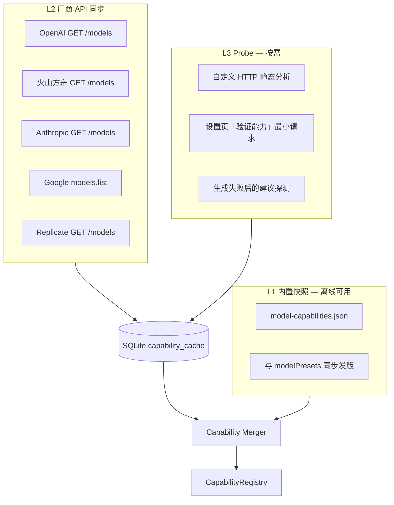

# LocalCanvas 模型能力系统重设计

> **目标**：让画布连线、生成器面板、Agent 选模**以模型真实能力为准**，而非节点类型硬编码；能力数据**自动获取与缓存**，用户只配置 API Key 与选用模型  
> **范围**：LLM / 图像 / 视频 / TTS 全链路；设置页重设计；主流模型能力目录  
> **日期**：2026-06-05  
> **状态**：✅ 核心已落地（Task 13–20）；增值项见 [V6 开发文档 §一.3](../LocalCanvas_v6_节点体验与能力系统.md)

---

## 零、评审确认决议（2026-06-05）

| # | 议题 | 决议 |
|---|------|------|
| 1 | P0 最低模型集 | ✅ **确认**：当前 presets + GPT-4o + Claude + Gemini；**另须纳入 DeepSeek V4 Pro / V4 Flash 及思考模式**（见 §2.6） |
| 2 | 非法连线策略 | ✅ **虚线警告**：拖拽时允许连接，边为虚线 + 警告色；**生成前硬阻断**并说明原因 |
| 3 | L4 远程签名目录 | ❌ **不做**：仅 L1 内置 + L2 厂商同步 + L3 Probe |
| 4 | 自定义 HTTP | ✅ **静态推断为主** + 设置页可选「验证能力」触发 Probe；生成失败可建议 Probe |
| 5 | 反思建议 | 见本文 §十二（评审后增补） |

---

## 一、设计定位

### 1.1 我们解决什么问题

当前 LocalCanvas 的连线兼容性由 `portCompat.ts` **按节点类型**硬编码，与**具体模型**无关：

| 现状 | 问题 |
|------|------|
| 所有 LLM 节点都显示相同输入口 | 用户把 3 张参考图连到 DeepSeek-Chat，连线成功但生成必败 |
| 所有视频节点都接受 `firstFrame` / `lastFrame` | Seedance 1.0 Pro Fast 不支持尾帧，连线无预警 |
| 设置页只有 endpoint + model 字符串 | 用户不知道模型能吃什么、能吐什么 |
| `modelPresets.ts` 无 `capabilities` | 新模型上线需改代码，无法覆盖「自定义 HTTP」 |

**核心命题**：画布是 DAG，边是否合法应由 **「上游输出模态 × 下游模型输入槽位」** 决定，而不是 **「上游节点类型 × 下游节点类型」**。

### 1.2 设计原则

1. **能力不可由用户手填**：用户只负责认证（API Key）与选型；能力来自权威目录 + 厂商探测 + 探测结果缓存
2. **连线分级契约**：`verified/documented` 能力下合法连线 = 运行时一定能组装请求；`inferred/unknown` 或槽位超限允许**虚线连接**探索，但**生成前必须阻断**并说明原因
3. **槽位优于模态**：同一「图片」在不同模型可能是 `reference_image×9`、`first_frame×1`、`image_edit×1` 等不同语义
4. **渐进覆盖**：内置 P0 目录保证离线可用；联网 L2 刷新扩展 P1/P2；未知模型走 Provider 模板 + 保守降级（**无远程 L4 目录**）
5. **与适配器同源**：能力描述与 `model-adapter` 请求组装共用一份 Schema，避免「能连但不能调」
6. **变体与运行时选项**：Pro/Flash 档位、思考/推理模式等差异用 `ReasoningProfile` + `runtime_prefs` 表达；仅当厂商**拆 model id**（如 Kimi instruct/thinking）才用多个 `profile_key`

### 1.3 成功标准

| 指标 | 目标 |
|------|------|
| 连线误通过率 | `verified` 非法连线生成前阻断率 100%；虚线警告边在生成前 100% 拦截 |
| 设置页认知负担 | 用户无需阅读厂商文档即可看懂模型能做什么 |
| 主流模型覆盖 | P0 清单覆盖项目已集成 + 用户最常配的 30+ 模型 |
| 能力新鲜度 | 联网刷新后 24h 内同步目录更新；离线可用内置快照 |
| 自定义模型 | 选 Provider 模板后自动继承该族默认能力，可选「探测校验」 |

---

## 二、能力本体论（Model Capability Ontology）

### 2.1 三层结构

```
Provider（厂商/SDK 族）
  └── Model（用户 config 中的 model 字符串）
        └── CapabilityProfile（输入槽位 + 输出类型 + 约束）
```

- **Provider**：`openai_compatible` / `volcengine_ark` / `anthropic` / `google_gemini` / `replicate` / `custom`
- **Model**：如 `gpt-4o`、`doubao-seedance-2-0-260128`、`deepseek-chat`
- **CapabilityProfile**：可版本化、可缓存、可合并（内置 ⊕ 探测 ⊕ 覆盖）

### 2.2 模态与槽位（Slot）分离

**模态（Modality）**：画布节点输出的数据类型

| 模态 ID | 来源节点 | 数据形态 |
|---------|----------|----------|
| `text` | text, script | string |
| `image` | image | url / base64 / assetId |
| `video` | video, compose | url / assetId |
| `audio` | audio | url / assetId |

**槽位（Input Slot）**：模型 API 接受的参数角色（一个模态可映射多个槽位）

| 槽位 ID | 典型用途 | 常见 max |
|---------|----------|----------|
| `prompt` | 文本提示词 | 1 |
| `system` | 系统指令（LLM） | 1 |
| `image` | 通用视觉输入（LLM vision） | 1–20 |
| `reference_image` | 风格/角色参考（图生图、视频参考） | 1–9 |
| `first_frame` | 视频首帧 | 1 |
| `last_frame` | 视频尾帧 | 1 |
| `reference_video` | 视频参考/延长 | 1 |
| `reference_audio` | 音频参考/口型 | 1 |
| `image_edit_source` | 图编辑底图 | 1 |
| `negative_prompt` | 负向提示（部分图模型） | 1 |

**输出（Output）**

| 输出 ID | 节点落点 |
|---------|----------|
| `text` | text 节点 output / 脚本结构化字段 |
| `image` | image 节点 |
| `video` | video 节点 |
| `audio` | audio 节点 |

### 2.3 CapabilityProfile Schema（建议）

```typescript
/** 能力来源与可信度 */
type CapabilitySource = 'builtin' | 'provider_api' | 'probe' | 'inferred'
type Confidence = 'verified' | 'documented' | 'inferred' | 'unknown'

interface InputSlotSpec {
  id: string                    // 槽位 ID，见 2.2
  modality: 'text' | 'image' | 'video' | 'audio'
  required: boolean
  min_count: number             // 默认 0
  max_count: number             // 1 = 仅单张；>1 = 多图
  /** 与画布 handle 的映射，如 image 节点 → reference_image */
  accepts_handles?: string[]
  constraints?: {
    max_file_mb?: number
    formats?: string[]          // jpeg, png, webp, mp4...
    min_pixels?: number
    max_pixels?: number
    max_duration_sec?: number
    /** 合规：如 Seedance 2.0 真人脸限制 */
    policy_notes?: string[]
  }
}

interface OutputSpec {
  modality: 'text' | 'image' | 'video' | 'audio'
  /** 异步任务型输出 */
  async?: boolean
  poll_required?: boolean
}

interface ModelCapabilityProfile {
  /** 稳定键：provider + model 归一化 */
  profile_key: string
  provider: string
  model_pattern: string         // 精确或 glob，如 doubao-seedance-2*
  kind: 'llm' | 'image' | 'video' | 'tts'
  display_name: string
  inputs: InputSlotSpec[]
  outputs: OutputSpec[]
  modes?: string[]              // t2v, i2v_first, i2v_fl, ref2v, t2i, i2i...
  features?: string[]           // vision, function_call, generate_audio, extend_video...
  limits?: {
    context_tokens?: number
    max_output_tokens?: number
    max_resolution?: string
    durations_sec?: number[]
  }
  source: CapabilitySource
  confidence: Confidence
  fetched_at?: string           // ISO8601
  doc_url?: string
  version: number               // 目录 schema 版本
  /** 运行时选项：思考模式、分辨率档位等（不改变输入输出模态） */
  runtime_options?: RuntimeOptionSpec[]
  /** 废弃 model id 映射，用于迁移提示 */
  aliases?: ModelAlias[]
}

/** 运行时选项：思考模式、分辨率等 — 映射到 API 参数，非用户手填能力 */
interface RuntimeOptionSpec {
  id: string                    // thinking_mode | thinking_budget | ...
  label: string                 // UI 展示名
  type: 'enum' | 'boolean' | 'integer' | 'preset'  // preset = 三档统一 UI
  control_kind: ReasoningControlKind  // 见 §2.7
  values?: Array<{
    value: string               // 厂商原始值或统一档位 id
    label: string
    hints?: string[]
    api_mapping: Record<string, unknown>  // 该档位对应的请求参数片段
  }>
  default: string
  affects?: Array<'latency' | 'cost' | 'max_output' | 'reasoning_trace' | 'fim' | 'stream_required'>
  /** integer 型：如 Gemini thinking_budget */
  range?: { min: number; max: number; step?: number; disable_at?: number }
  /** 统一三档 UI → 各档位 api_mapping（用户只见 关闭/标准/深度） */
  preset_levels?: Record<'off' | 'balanced' | 'deep', Record<string, unknown>>
}

/** 厂商推理控制形态（统计归纳，见 §2.7 矩阵） */
type ReasoningControlKind =
  | 'none'              // 无思考能力（gpt-4o）
  | 'hybrid_toggle'     // 同模型可开/关（Qwen enable_thinking、GLM thinking.type）
  | 'effort_levels'     // 枚举档位（DeepSeek、OpenAI o-series）
  | 'budget_tokens'     // 数值预算（Claude budget_tokens、Gemini thinking_budget）
  | 'adaptive_effort'   // 自适应 + effort（Claude 4.7+ adaptive）
  | 'always_reasoning'  // 推理型模型，仅能调 effort（o3-mini）
  | 'separate_model'    // 对话/推理拆成不同 model id（Kimi k2-instruct vs k2-thinking）

interface ModelAlias {
  deprecated_id: string         // deepseek-chat
  maps_to: string               // deepseek-v4-flash
  runtime_default?: string      // thinking: disabled
  sunset?: string               // 2026-07-24T15:59:00Z
  note?: string
}
```

### 2.6 推理/思考运行时选项（跨厂商统一设计）

> DeepSeek 只是典型样例。主流 LLM 普遍存在 **「快速对话 / 标准推理 / 深度推理」** 三类体验，但厂商实现方式高度分裂。本节给出**统计梳理 + 统一抽象 + UI/适配器方案**。

#### 2.6.0 三类用户感知（统一 UI 目标）

无论底层 API 如何，LocalCanvas 对用户只暴露**一个控件**（当模型支持时）：

| 统一档位 | 用户理解 | 典型场景 |
|----------|----------|----------|
| **关闭** | 快速回复、低延迟低成本 | 润色、翻译、简单改写 |
| **标准** | 平衡质量与速度 | 脚本结构化、复杂 prompt、多数生成 |
| **深度** | 最强推理、明显更慢更贵 | 数学、多步 debug、长链 Agent |

底层通过各模型 `preset_levels` 映射到厂商真实参数，**用户不接触** `enable_thinking`、`budget_tokens`、`reasoning_effort` 等细节。

---

### 2.7 主流模型推理能力统计矩阵（P0/P1）

> 调研日期：2026-06-05。能力入库时写入各 `profile.runtime_options`，非用户配置。

#### 2.7.1 控制形态分类（5 种架构模式）

| 模式 ID | 含义 | 代表厂商 | LocalCanvas 处理 |
|---------|------|----------|------------------|
| **A. 同模型开关** | 一个 model id，`enable/disable` 思考 | Qwen、GLM、Kimi k2.6、DeepSeek V4 | `hybrid_toggle` + 三档 preset |
| **B. 同模型 effort** | 一个 model id，枚举 low/med/high/max | DeepSeek V4、OpenAI o3/o3-mini | `effort_levels` + 三档 preset |
| **C. 数值预算** | `thinking_budget` / `budget_tokens` 整数 | Gemini 2.5、Claude 4.5–4.6、Qwen | `budget_tokens`；UI 仍用三档，内映射数值 |
| **D. 自适应 effort** | `thinking: adaptive` + `effort` | Claude 4.7+、Claude 4.6（推荐） | `adaptive_effort`；关闭档映射 effort=min |
| **E. 拆模型 id** | 对话与推理是不同 model 字符串 | Kimi k2-instruct / k2-thinking；旧 deepseek-chat / reasoner | `separate_model` 或 `aliases` |

**关键结论**：不能把「推理模式」一律做成独立模型条目，也不能假定所有模型都有 `disabled` 档（如 Gemini 2.5 Pro、QwQ、DeepSeek-R1）。

#### 2.7.2 P0 模型逐项梳理

| 厂商 | 模型（P0） | 控制形态 | 厂商参数 | 可选档位 / 范围 | 默认 | 思考输出字段 | 备注 |
|------|------------|----------|----------|-----------------|------|--------------|------|
| **DeepSeek** | `deepseek-v4-flash` | A+B | `thinking.type` + `reasoning_effort` | disabled / high / max | thinking on (high) | `reasoning_content` | 无 vision；FIM 仅 disabled |
| | `deepseek-v4-pro` | A+B | 同上 | 同上 | high | 同上 | Agent 向 |
| | `deepseek-chat` ⚠️ | alias | → v4-flash + disabled | — | — | — | 2026-07 停用 |
| | `deepseek-reasoner` ⚠️ | alias | → v4-flash + high | — | — | — | 2026-07 停用 |
| **OpenAI** | `gpt-4o` / `4o-mini` | — | 无思考开关 | — | — | — | 有 vision；P0 必选 |
| | `o3-mini` | E' always | `reasoning_effort` | low / medium / high | medium | reasoning summary | 无 vision |
| | `o3` | E' always | `reasoning.effort` | low / medium / high | medium | 同上 | Responses API |
| **Anthropic** | `claude-sonnet-4` / `4.5` | C | `thinking.type=enabled` + `budget_tokens` | 1024–32000+ | 动态 | `thinking` blocks | 手动模式 |
| | `claude-sonnet-4-6` | D（推荐） | `thinking.type=adaptive` + `effort` | low/med/high | adaptive | 同上 | 手动仍可用但 deprecated |
| | `claude-opus-4-7+` | D only | 仅 adaptive；manual 400 | effort | adaptive | 同上 | 无 budget_tokens |
| **Google** | `gemini-2.5-flash` | C | `thinking_budget` | 0 / -1(自动) / 1–24576 | -1 自动 | `thought` parts | 0=关闭 |
| | `gemini-2.5-pro` | C' partial | `thinking_budget` | 128–32768 | 自动 | 同上 | **不可关闭**思考 |
| **阿里 Qwen** | `qwen-max` / `qwen-plus` | A+C | `enable_thinking` + `thinking_budget` | on/off + budget | plus 默认 off | `reasoning_content` | 流式推荐 |
| | `qwen3.5-plus` 等 | A | `enable_thinking` | on/off（默认 on） | on | 同上 | 混合思考 |
| | `qwq` / `deepseek-r1` 等 | always | 无法关闭 | — | always | 同上 | 仅思考型 |
| **智谱 GLM** | `glm-4-flash`（现有 preset） | — / A | 视具体型号 | 4.5+ 支持 `thinking.type` | — | `reasoning_content` | preset 待升级 |
| | `glm-4.5` / `glm-4.7` / `glm-5` | A | `thinking.type` | enabled / disabled | 4.7+ 默认 enabled | 同上 | 轮级思考 |
| **Moonshot Kimi** | `kimi-k2-instruct` | — | 无思考 | — | — | — | 快速对话 |
| | `kimi-k2-thinking` | E always | 独立模型，始终推理 | — | always | `reasoning_content` | temp=1.0 推荐 |
| | `kimi-k2.6` | A | `thinking.type` | enabled / disabled | enabled | 同上 | `thinking.keep` 另列高级项 |

#### 2.7.3 统一三档 → 厂商参数映射（示例）

各 profile 在 `runtime_options[thinking_mode].preset_levels` 中定义：

| 统一档位 | DeepSeek V4 | OpenAI o3-mini | Claude 4.6 adaptive | Gemini 2.5 Flash | Qwen Plus | GLM-4.7 |
|----------|-------------|----------------|---------------------|------------------|-----------|---------|
| **关闭** | `thinking:disabled` | `reasoning_effort:low` ※ | `effort:low` 或关 adaptive ※ | `thinking_budget:0` | `enable_thinking:false` | `thinking.type:disabled` |
| **标准** | `reasoning_effort:high` | `reasoning_effort:medium` | `effort:medium` | `thinking_budget:-1` | `enable_thinking:true` | `thinking.type:enabled` |
| **深度** | `reasoning_effort:max` | `reasoning_effort:high` | `effort:high` | `thinking_budget:8192` | `enable_thinking:true` + budget↑ | `thinking.type:enabled` + 保留思考 |

※ **无法真正关闭思考的模型**（o 系列、Gemini Pro）：UI 仍显示三档，但「关闭」映射为**最低 effort/预算**，并在控件旁标注「该模型总会进行一定推理」。

#### 2.7.4 不适合统一控件的情况

| 情况 | 处理 |
|------|------|
| 模型无思考能力（gpt-4o） | 生成器**不显示**思考控件 |
| 思考型独立模型（kimi-k2-thinking） | 不显示开关；选该模型即隐含「深度推理」 |
| 思考不可关闭（Gemini 2.5 Pro、QwQ） | 显示控件但「关闭」灰显或改文案为「低推理」 |
| 仅支持流式（部分 Qwen） | 选非关闭档时自动 `stream:true`，或提示用户 |

---

### 2.8 统一实现方案

#### 2.8.1 数据结构：推理能力附表

在 `ModelCapabilityProfile` 上增加可选块（与 `runtime_options` 二选一或合并）：

```typescript
interface ReasoningProfile {
  control_kind: ReasoningControlKind
  /** 用户可见三档；不存在则隐藏控件 */
  ui_preset: 'off_balanced_deep' | 'hidden' | 'model_implied'
  preset_levels?: Record<'off' | 'balanced' | 'deep', Record<string, unknown>>
  /** 推理链输出字段名，供 UI 折叠展示 */
  output_field?: 'reasoning_content' | 'thinking' | 'thought_summary'
  /** 多轮是否须回传历史推理（Agent/脚本） */
  preserve_reasoning_default?: boolean
  stream_required_when_enabled?: boolean
  warnings?: string[]           // 「关闭档不可用」「建议 max_tokens≥384K」
}
```

节点 `data` 存储用户选择（非能力配置）：

```typescript
interface NodeRuntimePrefs {
  thinking_preset?: 'off' | 'balanced' | 'deep'  // 默认 balanced
  // 高级折叠，一期可不做：
  thinking_budget?: number
  preserve_reasoning?: boolean
}
```

#### 2.8.2 UI 规则（生成器 / 文本节点 / 脚本节点）

```
若 profile.reasoning.ui_preset === 'hidden' → 不渲染
若 === 'model_implied' → 徽章「推理模型」，无下拉
若 === 'off_balanced_deep' → 下拉 [ 快速 | 标准 | 深度 ]
  - 切换时更新 latency/cost 提示条
  - 深度档：若 warnings 含 max_tokens，联动调高节点 max_tokens 建议值
```

设置页模型卡片**额外徽章**：`思考：可关` / `思考：仅调强度` / `思考：独立模型` / `无思考`

#### 2.8.3 适配器层：`buildReasoningParams(profile, preset)`

```
electron/utility/services/model-adapter/reasoning-params.ts

输入：profile + NodeRuntimePrefs + provider
输出：合并进 chat completion 请求的参数片段

禁止在 adapter 内硬编码厂商分支散落各处；
各 profile 的 preset_levels 为唯一映射源。
```

#### 2.8.4 Agent 选模扩展

| 任务信号 | 模型 + preset 策略 |
|----------|-------------------|
| 快速润色 / 翻译 | text-only LLM + `off` |
| 脚本分镜 / 结构化 | 支持思考的模型 + `balanced` |
| 复杂推理 / 数学 | v4-pro / o3 / k2-thinking + `deep` |
| 需 vision | 过滤 `inputs` 含 image；思考控件独立 |
| 需极低延迟 | 排除 `always_reasoning` 与 preset=deep |

#### 2.8.5 与「模型档位」的关系（重申）

| 维度 | 示例 | 存储 |
|------|------|------|
| 档位（Pro/Flash） | deepseek-v4-pro vs flash | 不同 `profile_key`，不同 config 条目 |
| 思考 preset | off / balanced / deep | 节点 `runtime_prefs`，同一 profile 内切换 |
| 废弃/别名 | deepseek-chat | `aliases` 自动迁移 |
| 拆模型 | kimi-k2-instruct vs thinking | 两个 `profile_key`，无 preset 或 thinking 仅 deep |

---

### 2.9 DeepSeek 样例（验证统一方案）

#### 2.9.1 DeepSeek V4 结构（P0 必纳）

| 维度 | 取值 | 说明 |
|------|------|------|
| **模型档位** | `deepseek-v4-pro` | 复杂推理、Agent、长上下文分析 |
| | `deepseek-v4-flash` | 默认对话、高吞吐、低成本 |
| **思考模式** | `disabled` | 最快最便宜；支持 FIM (Beta) |
| | `high` | V4 默认；返回 `reasoning_content` + `content` |
| | `max` | 深度推理；建议 `max_tokens` ≥ 384K 防截断 |
| **上下文** | 1M tokens | Pro / Flash 均为默认 |
| **视觉** | ❌ | 两档均 **text in / text out**，无 image 槽位 |

**废弃别名（须内置迁移提示）**

| 旧 ID | 路由目标 | 下线时间 |
|-------|----------|----------|
| `deepseek-chat` | `deepseek-v4-flash` + thinking `disabled` | 2026-07-24 UTC |
| `deepseek-reasoner` | `deepseek-v4-flash` + thinking `high` | 2026-07-24 UTC |

#### 2.9.2 DeepSeek 在统一 UI 下的映射

```json
{
  "profile_key": "deepseek-v4-flash",
  "reasoning": {
    "control_kind": "effort_levels",
    "ui_preset": "off_balanced_deep",
    "output_field": "reasoning_content",
    "preset_levels": {
      "off":      { "extra_body": { "thinking": { "type": "disabled" } } },
      "balanced": { "reasoning_effort": "high", "extra_body": { "thinking": { "type": "enabled" } } },
      "deep":     { "reasoning_effort": "max",  "extra_body": { "thinking": { "type": "enabled" } } }
    },
    "warnings": ["深度档建议 max_tokens ≥ 384000"]
  }
}
```

用户只见 `[ 快速 | 标准 | 深度 ]`，与 GPT/Claude/Qwen 控件**位置与文案一致**。

#### 2.9.3 推广规则（所有厂商）

| 规则 | 说明 |
|------|------|
| 档位 = 不同 `profile_key` | Pro/Flash、instruct/thinking 等 |
| 思考 = `ReasoningProfile` + 节点 `runtime_prefs` | 不改变连线模态 |
| 废弃 ID = `aliases` | 含 `runtime_default` |
| 推理输出 | 折叠展示 `reasoning_content` / `thinking`，**默认不进下游** |
| 厂商差异 | 只允许出现在 `preset_levels`，禁止散落 UI 文案 |

### 2.4 能力合并规则

解析某用户配置的模型时，按优先级合并：

```
1. 用户 config 中 model 精确匹配 builtin 目录
2. provider_api 缓存（24h TTL）中同 model 记录
3. glob 匹配（如 seedance-2* → Seedance 2.0 模板）
4. Provider 默认模板（openai_compatible + kind=llm → 仅 text in/out）
5. 标记 confidence=unknown，UI 显示「能力未验证」，连线允许但标为**虚线警告**
```

**禁止**：让用户在 UI 勾选「支持图片输入」—— 最多允许高级用户触发 **「重新探测」** 按钮。

### 2.5 与画布 Handle 的映射

| 上游 handle | 模态 | 可落入槽位（示例） |
|-------------|------|-------------------|
| `text:prompt` | text | `prompt`, `system`, `negative_prompt` |
| `image:image` | image | `image`, `reference_image`, `first_frame`, `last_frame`, `image_edit_source` |
| `video:video` | video | `reference_video` |
| `audio:audio` | audio | `reference_audio` |
| `compose:composed` | video | `reference_video` |
| `script:script` | text | `prompt`（结构化脚本摘要） |

**连线判定算法（伪代码）**：

```
type EdgeCompat = 'solid' | 'dashed_warn'

canConnect(edge) -> EdgeCompat | reject:
  src = resolveModality(sourceNode, sourceHandle)
  tgtModel = targetNode.data.selectedModelId
  profile = CapabilityRegistry.resolve(tgtModel)
  slot = profile.findSlotAccepting(src.modality, targetHandle)

  if !slot:
    if profile.confidence in (inferred, unknown):
      return dashed_warn("能力未验证：该模型可能不接受此输入")
    return reject("该模型不接受此类型输入")  // 极少：类型完全不匹配

  if slot.max_count exceeded:
    return dashed_warn("已超出该模型图片上限 N 张")

  if profile.confidence in (inferred, unknown):
    return dashed_warn("能力未验证，生成时可能失败")

  return solid

validateBeforeGenerate(edge):
  // 对所有 dashed_warn 边：阻断生成，展示聚合原因 + [重新探测] [仍要尝试]（P2 可选）
  // verified/documented 边：正常通过
```

---

## 三、能力获取策略（非用户配置）

### 3.1 三层数据源（已决议：无 L4）



| 层级 | 说明 | 何时刷新 |
|------|------|----------|
| L1 内置 | 随 App 发版的 `capabilities/` 目录，覆盖 P0 模型 | 每个版本 |
| L2 厂商 API | 拉模型列表 + **文档映射表**转 CapabilityProfile | 设置页打开 / 每日首次启动 / 手动刷新 |
| L3 Probe | 自定义 HTTP：**默认静态推断**；用户主动或失败回写时探测 | 按需 |

**新模型纳入路径**：无远程 feed → 依赖 **App 版本升级** 扩充 L1；L2 仅帮助发现「账户已开通但未入库」的 model id 并提示用户等待版本更新。

**说明**：OpenAI `/v1/models` **不返回**模态字段，仅返回 `id/created/owned_by`。因此 L2 必须配合 **厂商文档映射表**（L1 的一部分），不能单靠 list API。

### 3.2 缓存设计

| 字段 | 说明 |
|------|------|
| 存储 | `userData/capabilities/cache.sqlite` 或并入现有 DB |
| TTL | `verified` 7 天，`documented` 30 天，`inferred` 1 天 |
| 失效 | App 升级内置目录 version 递增时合并刷新 |
| 离线 | 仅用 L1 + 本地缓存，UI 标注「上次同步时间」 |

### 3.3 Provider 级默认模板（降级）

当无法精确匹配时，按 `provider + kind` 套用保守模板：

| Provider + Kind | 默认输入 | 默认输出 | confidence |
|-----------------|----------|----------|------------|
| openai_compatible + llm | text×1 | text | inferred |
| openai_compatible + image | prompt×1 | image | inferred |
| volcengine_ark + video | prompt×1, first_frame×1 | video async | documented |
| replicate + image | prompt×1 | image async | documented |
| custom + * | prompt×1 | 由 kind 推断 | unknown |

自定义 HTTP 适配器（已决议）：

1. **默认**：根据 `request_template` 关键字静态推断（`image_url`、`messages[].content[]` 等）→ `confidence=inferred` → 虚线连线
2. **可选**：设置页「验证能力」触发 Probe → 升级为 `verified` / `documented`
3. **失败回写**：生成报 `unsupported_*` 时建议用户探测，不自动静默改能力

### 3.4 与现有代码的关系

| 现有模块 | 改造方向 |
|----------|----------|
| `portCompat.ts` | 保留节点类型兜底；新增 `isModelPortCompatible(profile, ...)` |
| `modelPresets.ts` | 预设增加 `profile_key` 引用，不再重复写能力 |
| `seedance.ts` `getSeedanceCapabilities` | 迁入统一 Registry，Seedance 成为 profile 子集 |
| `SettingsPanel.tsx` | 重设计为「模型目录 + 能力徽章 + 认证」 |
| `GeneratorPanel.tsx` | 按 profile 动态显示可用参数（尾帧、多参考图等） |
| `model-adapter/*` | 读取同一 profile 组装请求，避免双份逻辑 |

---

## 四、设置页重设计

### 4.1 信息架构

**从「按 kind 分 Tab 填表」→「模型目录 + 已接入实例」**

```
┌─────────────────────────────────────────────────────────────┐
│  模型与能力                                    [同步目录 ↻]  │
├──────────────┬──────────────────────────────────────────────┤
│ 筛选         │  已接入模型                                   │
│ □ LLM        │  ┌─────────────────────────────────────────┐ │
│ □ 图像       │  │ GPT-4o          🟢 已连接  上次同步 2h前 │ │
│ □ 视频       │  │ 入: 文·图(≤10)  出: 文                    │ │
│ □ 语音       │  │ [设为默认LLM] [测试] [详情]               │ │
│              │  └─────────────────────────────────────────┘ │
│ 能力标签     │  ┌─────────────────────────────────────────┐ │
│ 多图  视频入 │  │ Seedance 2.0    🟡 未配置 Key            │ │
│ 尾帧  音频   │  │ 入: 文·首帧·尾帧·参考图(≤9)·参考视频·音频  │ │
│              │  │ 出: 视频(异步)  ⚠ 真人脸合规限制          │ │
│ [+ 添加模型] │  └─────────────────────────────────────────┘ │
├──────────────┴──────────────────────────────────────────────┤
│  添加模型：搜索/浏览目录 → 选模型 → 仅填 API Key → 完成      │
└─────────────────────────────────────────────────────────────┘
```

### 4.2 模型详情抽屉

- **能力徽章**：入/出模态图标 + 数量上限（如 `图 ≤9`）
- **支持模式**：文生视频 / 首尾帧 / 多模态参考 / 图编辑…
- **限制**：分辨率、时长、context、合规说明
- **来源**：内置 / 已同步 / 推断，及 `doc_url` 链接
- **操作**：测试连接、重新探测、设为默认、移除

### 4.3 添加模型流程（简化）

1. 浏览**模型目录**（非裸填 endpoint）
2. 选中后自动带入 `endpoint`、`model`、`profile_key`
3. 用户只填 **API Key**（或选环境变量）
4. 可选：立即测试 + 探测
5. 保存后写入 `config.yaml`，**不写入 capabilities**（能力不入用户配置）

### 4.4 画布侧联动

- 节点模型下拉：只列出 **kind 匹配且已配置 Key** 的模型
- 切换模型时：**自动校验现有入边**，不兼容边改**虚线 + 琥珀色** + 悬浮原因；兼容边为实线
- 生成器面板：隐藏当前模型不支持的参数（如尾帧、多图上传区）

---

## 五、主流模型能力目录（路线图）

### 5.1 P0 — 已确认最低集（首发内置）

| 模型 | kind | 输入槽位 | 输出 | 备注 |
|------|------|----------|------|------|
| **DeepSeek V4 Flash** | llm | prompt | text | `ReasoningProfile` 三档；1M ctx；§2.9 |
| **DeepSeek V4 Pro** | llm | prompt | text | 同上；Agent 向 |
| ~~deepseek-chat / reasoner~~ | — | — | — | **alias** → v4-flash；§2.7.2 |
| GLM-4.5 / 4.7 / 5 | llm | prompt | text | `thinking.type`；4.7+ 默认 enabled |
| GLM-4 Flash（现有） | llm | prompt | text | 待确认是否 vision；preset 升级 |
| 通义 qwen-max / qwen-plus | llm | prompt | text | `enable_thinking`；plus 默认 off |
| GPT-4o / 4o-mini | llm | prompt, image≤10 | text | 无思考控件 |
| OpenAI o3-mini | llm | prompt | text | 仅 effort；`always_reasoning` |
| Claude Sonnet 4 / 4.6 | llm | prompt, image≤20 | text | adaptive 或 budget；§2.7.2 |
| Gemini 2.5 Flash | llm | prompt, image, audio, video | text | `thinking_budget` 可关闭 |
| Gemini 2.5 Pro | llm | 同上 | text | 思考不可关，仅调强度 |
| Kimi k2-instruct | llm | prompt | text | 无思考 |
| Kimi k2-thinking | llm | prompt | text | `model_implied` 深度推理 |
| DALL-E 3 | image | prompt | image | 无图生图 |
| Seedream 4.5 / 4.0 | image | prompt, reference_image≤? | image | 火山方舟 |
| Flux Dev (Replicate) | image | prompt | image async | |
| Seedance 1.0 Pro Fast | video | prompt, first_frame×1 | video async | 无尾帧/参考图 |
| Seedance 2.0 / 2.0 Fast | video | prompt, first_frame, last_frame, reference_image≤9, reference_video, reference_audio | video async | 合规限制 |
| OpenAI TTS | tts | prompt(text) | audio | |

### 5.2 P1 — 高频扩展（第二周）

| 厂商 | 代表模型 | 关键差异能力 |
|------|----------|--------------|
| OpenAI | gpt-4.1, o3, gpt-image-1 | 图编辑、结构化输出 |
| Anthropic | claude-haiku | 低成本 vision |
| Google | gemini-2.5-pro, imagen 3 | 视频理解、图生成 |
| 阿里 | qwen-vl-max, wanx2.1 | 图文、图生成 |
| 字节 | Seedream 5.x（跟进） | 跟随官方文档 |
| Kling 可灵 | 图生视频 | 首尾帧、运动笔刷 |
| Minimax | video-01 | 图生视频 |
| Runway | gen-3 | 图/文生视频 |
| Luma | ray-2 | 文/图生视频 |
| ElevenLabs | eleven_multilingual_v2 | TTS 多语言 |
| Azure OpenAI | 部署名映射 | deploymentId ≠ modelId |

### 5.3 P2 — 长尾与生态

- **本地推理**：Ollama / LM Studio（探测 `/api/show`）
- **聚合网关**：OpenRouter、Together、Fireworks（按路由模型字符串查目录）
- **国内**：百度文心、腾讯混元、讯飞星火
- **专业**：Stable Diffusion WebUI API、ComfyUI workflow 节点

### 5.4 目录维护流程

1. 产品/研发每周扫厂商 Release Note
2. 更新 `capabilities/builtin/*.json`
3. 递增 `catalog_version`，App 启动时 diff 合并
4. 关键模型变更写 CHANGELOG，设置页显示「目录已更新」

---

## 六、画布与 Agent 集成要点

### 6.1 节点端口动态化（中期）

今日图片节点统一 `image` 输出口；视频节点保留 `prompt` / `firstFrame` / `lastFrame` / `video` / `audio`。

**阶段 1**：保持 handle ID 不变，用 profile 在连线层过滤  
**阶段 2**：选中模型后，**隐藏**不可连的 target handle，**灰显**已满的槽位（如参考图 9/9）

### 6.2 生成前校验

`useModelGeneration` 在发 IPC 前：

```
validateInputs(profile, resolvedInputs):
  - 必填槽位是否满足
  - 图片数量是否超限
  - 文件格式/大小（资产元数据）
  - 政策约束（弹窗确认，如真人脸）
```

### 6.3 Agent 智能选模（增值）

Agent 规划 DAG 时查询 Registry：

- 「需要 vision」→ 过滤 `inputs` 含 `image` 的 LLM
- 「需要尾帧连贯」→ 优先 Seedance 2.0 + `last_frame`
- 「仅需文案」→ 选最便宜 text-only LLM

避免 Agent 写出画布无法执行的图。

### 6.4 能力图谱（增值）

在项目级展示：

```
[文本] ──→ [GPT-4o] ──→ [润色文案] ──→ [Seedream] ──→ [图]
                              └──→ [Seedance 2.0 首帧] ──→ [视频]
```

用于一键检查「这条链路是否被当前已配置模型支持」。

---

## 七、增值观点（建议纳入 v1）

### 7.1 「槽位占用」比「能不能连」更重要

用户真正困惑的是：**「我还能再连几张图？」**  
建议在 target handle 旁显示 `2/9` 计数，比单纯禁止/允许更有用。

### 7.2 不合规连线：「虚线警告 + 运行前阻断」（✅ 已采纳）

拖拽时允许连接，边样式区分：

| 样式 | 条件 |
|------|------|
| **实线** | `verified/documented` 且槽位未满 |
| **虚线 + 琥珀色** | `inferred/unknown`、槽位超限、或模态可能不兼容 |

生成前：所有虚线边聚合为阻断清单；用户需断开或触发「验证能力」后再生成。

### 7.3 能力变更的版本钉扎（Pin）

项目文件保存 `capability_catalog_version` + 各节点 `profile_key`。  
打开旧项目时若目录升级，提示「Seedance 2.0 现支持参考视频，是否解锁新端口？」—— 避免静默行为变化。

### 7.4 失败回写（Failure-driven refinement）

生成失败若错误码为 `unsupported_multimodal` / `invalid_image_count`，自动触发单次 Probe 并更新缓存，减少重复失败。

### 7.5 同一 API Key 多模型发现

设置页「同步」时合并 L2 返回的模型列表，标记**已开通但未添加**的模型，一键加入 —— 降低配置摩擦。

### 7.6 与计价/配额联动（远期）

能力 Profile 附带 `pricing_hint`（可选），Agent 在「质量 vs 成本」策略下选模。

---

## 八、非目标（本期不做）

- 让用户手动编辑 CapabilityProfile JSON
- 在设置页配置「支持哪些输入」（与原则 1 冲突）
- **L4 远程签名能力目录**（已决议不做）
- 覆盖所有开源本地模型的完整矩阵（P2 逐步做）
- 替代厂商文档的法律责任声明（仅展示 `policy_notes` 链接）
- 将 DeepSeek 思考模式拆成独立「模型条目」（应用 `runtime_options` 即可）

---

## 九、评审清单 — 遗漏与风险

### 9.1 功能遗漏检查

| # | 检查项 | 状态 | 说明 |
|---|--------|------|------|
| 1 | LLM 多图上限（GPT-10、Claude-20） | ⚠️ 待量化 | 需逐模型写入 `max_count` |
| 2 | 视频「延长」vs「参考」槽位区分 | ⚠️ | `reference_video` 与 extend 模式 API 不同 |
| 3 | 图生图 / inpainting 编辑底图 | ⚠️ | DALL-E edit、GPT Image 需 `image_edit_source` |
| 4 | 脚本节点结构化输出（非纯 text） | ⚠️ | script → JSON 场景是否走 text 槽位 |
| 5 | 合成编辑器输出连到视频参考 | ✅ | `compose:composed` → `reference_video` |
| 6 | TTS 输入是 text 但不可接 image | ✅ | kind=tts 模板隔离 |
| 7 | 异步模型 poll 与能力分离 | ⚠️ | `outputs.async` 影响 UI 进度，非连线 |
| 8 | 同一节点切换模型后边的清理策略 | ⚠️ | 需 UX 规则：标红 vs 自动删除 |
| 9 | 自定义 HTTP 适配器能力推断 | ⚠️ | 仅静态模板，可能不准 |
| 10 | i18n 能力描述文案 | ⚠️ | 徽章、拒绝原因需中英文 |
| 11 | 多 API Key 同厂商多区域 endpoint | ⚠️ | Azure / 私有部署 deployment 名 |
| 12 | Seedance 真人脸合规 | ✅ | `policy_notes` + 生成前确认 |
| 13 | Replicate 动态模型版本 | ⚠️ | `owner/name:version` 需版本钉扎 |
| 14 | 离线首次启动无缓存 | ✅ | L1 内置兜底 |
| 15 | Agent 自动选模与能力 Registry 同步 | ⚠️ | 依赖 Registry API 暴露给 agent 层 |
| 16 | DeepSeek V4 Pro/Flash 分档 | ✅ | P0 两档 + runtime_options |
| 17 | DeepSeek 思考模式 API 映射 | ⚠️ | `thinking.type` + `reasoning_effort` 写入 adapter |
| 18 | `reasoning_content` 是否进下游 | ⚠️ | 默认仅展示，不写 `output` |
| 19 | 旧 config `deepseek-chat` 迁移 | ⚠️ | 启动时 alias + 一次性 toast |
| 20 | 虚线边在项目保存/重载 | ⚠️ | 边存 `compat: dashed_warn` 状态 |
| 21 | 跨厂商思考三档映射表 | ✅ | §2.7.2 / §2.7.3 |
| 22 | 无法关闭思考的模型 UI | ⚠️ | 「关闭」→ 最低 effort + 文案 |
| 23 | o 系列 / Gemini Pro 伪关闭档 | ⚠️ | preset_levels 特殊映射 |
| 24 | 节点 `runtime_prefs` 持久化 | ⚠️ | 随项目保存 thinking_preset |
| 25 | 推理输出是否进下游 | ✅ | 默认不进，折叠展示 |
| 26 | Qwen 流式强制 | ⚠️ | enabled 时 adapter 强制 stream |
| 27 | Kimi 拆模型 vs k2.6 单模型 | ✅ | separate_model vs hybrid_toggle |

### 9.2 技术风险

| 风险 | 缓解 |
|------|------|
| 厂商 API 不返回能力 | L1 文档映射为主，L2 仅辅助发现新 model id |
| 能力变更未通知 | catalog_version + 项目 pin + 更新提示 |
| portCompat 双轨维护 | 单测覆盖「旧类型兼容 + 新 profile 兼容」 |
| 性能：每边查询 Registry | 内存索引 + 按 modelId 缓存 profile |
| 用户自定义 model 字符串拼写错误 | 测试连接时模糊匹配建议 |

### 9.3 评审结论（已确认）

| 维度 | 评价 |
|------|------|
| 问题定义 | ✅ 与现状痛点、代码位置对齐 |
| 用户配置边界 | ✅ 明确禁止手填能力 |
| 获取策略 | ✅ L1+L2+L3 可落地；**无 L4**；新模型靠版本发版 |
| 画布集成 | ✅ 虚线警告 + 生成前阻断；分阶段改端口 |
| 模型覆盖 | ✅ P0 含 DeepSeek V4 双档 + 思考模式；P1 持续扩充 |
| 增值设计 | ✅ 槽位计数、项目 pin、失败回写建议纳入 |

**用户确认摘要（2026-06-05）**：P0 最低集 ✅｜虚线警告 ✅｜无 L4 ✅｜自定义 HTTP 静态+Probe ✅｜DeepSeek 变体纳入 ✅

---

## 十二、反思与补充建议（评审后）

### 12.1 对本次决议的反思

**虚线警告是正确的权衡。** 创作工具里用户常「先连上再试」；硬拦会打断心流。但须严守 **生成前阻断**，否则虚线会变成「可忽略的装饰」。建议在生成按钮旁显示「2 条未验证连线」，比仅改边颜色更显眼。

**不做 L4 的长期代价可接受，但要制度化 L1 更新节奏。** 没有远程 feed，新模型（如 DeepSeek V4.1）只能等发版。建议：每个 minor 版本至少扫一遍主流厂商 Release Note；设置页对 L2 发现但未入库的 model id 显示「即将在下一版本支持」，管理预期。

**跨厂商思考模式比 DeepSeek 更复杂，但可以用一套 UI 收敛。** 统计下来有 5 种控制形态（§2.7.1），用户只见「快速/标准/深度」三档，差异全部塞进 `preset_levels`。一期必须上线 `ReasoningProfile` + `buildReasoningParams()`，否则每个 adapter 都会长成 if-else 地狱。

### 12.2 建议你额外关注的三点

1. **边状态持久化**：虚线边需存 `edge.data.compatStatus`，否则重开项目后警告丢失，违背「生成前阻断」。
2. **思考模式的成本可见性**：`high/max` 可能使 output token 暴增；生成器应在选 `max` 时轻量提示「耗时与费用显著增加」，Agent 默认用 `disabled` 除非任务标注「推理」。
3. **迁移窗口**：2026-07-24 前同时支持 alias 与 V4 新 ID；设置页对仍使用 `deepseek-chat` 的配置显示倒计时横幅，避免用户踩下线。

### 12.3 我认为最有价值的增量（建议在 Phase 1–2 做）

| 优先级 | 能力 | 理由 |
|--------|------|------|
| P0+ | 槽位计数 `2/9` | 与虚线策略互补，减少「连上了但超限」 |
| P0+ | `ReasoningProfile` 三档控件 | 与虚线策略并列，一期核心体验 |
| P0+ | DeepSeek / Qwen / GLM alias 与 preset 迁移 | 当前 presets 过时 |
| P1 | 生成前「连线健康检查」面板 | 一键查看全项目虚线边 + 断开/探测 |
| P1 | `reasoning_content` 折叠展示 | 思考模式用户需要看见推理链，但不污染下游 text 输出 |
| P2 | 项目级能力 pin | 目录升级后提示差异，避免静默行为变化 |

### 12.4 潜在盲点（坦诚列出）

- **虚线 + 「仍要尝试」**：若未来允许绕过阻断，会变成事故入口；一期不做绕过，只提供「去验证能力」。
- **同一节点 Pro/Flash 切换**：思考模式可保留，但若从 Flash 切到 Pro，虚线边规则不变，但 `runtime_options` 默认值可能需重置提示。
- **无 L4 时竞品上新速度**：若对手支持「当天上新模型」，我们只能靠 hotfix 发版；可接受则维持现状，不可接受则再议「非签名、只读 GitHub raw 目录」轻量方案（仍非 L4 签名服务）。

---

## 十、实施阶段建议（供后续 writing-plans）

| 阶段 | 内容 | 预估 |
|------|------|------|
| Phase 0 | Profile + `ReasoningProfile` + `preset_levels` + P0 JSON + `reasoning-params.ts` 骨架 | 3d |
| Phase 1 | 实线/虚线边 + `portCompat` / `dataFlow` / 生成前阻断 + DeepSeek alias 迁移 | 2.5d |
| Phase 2 | 设置页重设计 + L2 同步 + 缓存 | 3d |
| Phase 3 | GeneratorPanel 动态参数 + 节点 handle 灰显 | 2d |
| Phase 4 | Agent 选模 + 能力图谱 + P1 目录扩展 | 3d |

---

## 十一、附录

### A. 相关现有文件

| 模块 | 路径 |
|------|------|
| 连线兼容 | `src/utils/portCompat.ts` |
| 数据流 | `src/utils/dataFlow.ts` |
| 模型配置类型 | `src/types/config.ts` |
| 预设 | `src/constants/modelPresets.ts` |
| Seedance 能力 | `src/constants/seedance.ts` |
| 设置面板 | `src/components/panels/SettingsPanel.tsx` |
| 适配器 | `electron/utility/services/model-adapter/` |
| v2 模型文档 | `docs/v2/LocalCanvas_v2_模型配置与生成器系统.md` |

### B. 参考来源（调研日期 2026-06-05）

- [OpenAI Images and vision](https://developers.openai.com/api/docs/guides/images-vision)
- [OpenAI Models](https://developers.openai.com/api/docs/models)
- [Azure GPT vision](https://learn.microsoft.com/en-us/azure/ai-foundry/openai/how-to/gpt-with-vision)（单请求最多 10 图）
- [火山方舟 Seedance 2.0 API](https://www.volcengine.com/docs/82379/1520757)
- [DeepSeek V4 发布公告](https://api-docs.deepseek.com/news/news260424)
- [DeepSeek Models & Pricing](https://api-docs.deepseek.com/quick_start/pricing)
- [DeepSeek Thinking Mode](https://api-docs.deepseek.com/guides/thinking_mode)
- [OpenAI Reasoning models](https://developers.openai.com/api/docs/guides/reasoning)
- [Claude Extended / Adaptive thinking](https://platform.claude.com/docs/en/build-with-claude/extended-thinking)
- [Gemini Thinking](https://ai.google.dev/gemini-api/docs/thinking)
- [Qwen Thinking](https://docs.qwencloud.com/developer-guides/text-generation/thinking)
- [GLM Thinking Mode](https://docs.bigmodel.cn/cn/guide/capabilities/thinking-mode)
- [Kimi K2 Thinking](https://platform.kimi.ai/docs/guide/use-kimi-k2-thinking-model)
- 第三方整理：Seedance 2.0 多模态槽位（first_frame / last_frame / reference_image≤9）

### C. 文档修订记录

| 版本 | 日期 | 说明 |
|------|------|------|
| 0.1 | 2026-06-05 | 初稿：能力本体、获取策略、设置页、目录路线图、评审清单 |
| 0.2 | 2026-06-05 | 评审确认：P0+DeepSeek V4、虚线警告、无 L4、静态+Probe；§2.6/§十二 |
| 0.3 | 2026-06-05 | 跨厂商推理矩阵 §2.7–§2.9、`ReasoningProfile` 统一方案、P0 目录扩充 |
| 0.4 | 2026-06-08 | 附录 D：合并原 Superpowers 实施计划为实施记录 |

---

## 附录 D：实施记录（2026-06-05）

> 原 `docs/superpowers/plans/2026-06-05-model-capability-system.md` 已归档至本文。  
> **目标**：以 `ModelCapabilityProfile` + `ReasoningProfile` 驱动画布连线（实线/虚线）、生成前校验与 LLM 思考档位，覆盖 P0 主流模型。  
> **架构**：L1 内置 `src/capabilities/builtin/profiles.ts` + `CapabilityRegistry`；`edge-compat.ts` 连线评估；`reasoning-params.ts` 三档映射厂商 API。

### D.1 模块索引

| 文件 | 职责 |
|------|------|
| `src/types/capability.ts` | Profile / Reasoning / EdgeCompat 类型 |
| `src/capabilities/builtin/profiles.ts` | P0 内置能力目录 |
| `src/capabilities/registry.ts` | resolve(profile_key / model / configId) |
| `src/capabilities/reasoning-params.ts` | buildReasoningParams |
| `src/capabilities/edge-compat.ts` | evaluateEdgeCompat + 生成前聚合校验 |
| `src/capabilities/generation-guard.ts` | 生成前虚线边阻断 |
| `src/capabilities/handle-slots.ts` | handle → modality/slot |
| `src/capabilities/node-port-ui.ts` | 按 profile 动态端口 |
| `src/capabilities/generator-ui.ts` | Generator UI 能力标志 |
| `src/utils/canvasEdge.ts` | 实线/虚线样式 |
| `src/stores/canvasStore.ts` | onConnect 写入 compatStatus |

### D.2 Phase 0–1：能力内核与画布连线 ✅

| 任务 | 内容 | 状态 |
|------|------|------|
| 类型定义 | `ModelCapabilityProfile`、`ReasoningProfile`、`EdgeCompatStatus` 等 | ✅ |
| P0 内置目录 | DeepSeek V4、GPT-4o、Claude、Gemini、Qwen、GLM、Kimi、Seedream/Seedance 等 | ✅ |
| Registry | `resolveProfile`、alias 迁移、provider 降级 | ✅ |
| Reasoning 参数 | `buildReasoningParams` + 单测 | ✅ |
| Handle → Slot | `sourceHandleToModality`、`targetHandleToSlotId` | ✅ |
| Edge 兼容评估 | `solid / dashed_warn / reject` + `collectInboundEdgeWarnings` | ✅ |
| 虚线边样式 | `edgeStyleForCompat`、`connectionToEdgeParams` | ✅ |
| Store + Canvas | onConnect 写 compat；isValidConnection 允许 dashed | ✅ |
| 生成前阻断 | `assertNoWarnEdgesForNode` 接入文本/图/视频生成 | ✅ |
| LLM 思考档位 | `thinkingPreset` 节点字段 + adapter 合并 reasoning 参数 | ✅ |

### D.3 Phase 2：设置页与生成器 ✅

| 任务 | 内容 | 状态 |
|------|------|------|
| Task 13 设置页 | 已接入模型 Tab、能力徽章、详情抽屉、目录添加 | ✅ |
| Task 14 动态参数 | `generator-ui`；`VideoEditorPanel` / `ImageEditorPanel` guard 与徽章 | ✅ |
| Task 15 参考媒体 API | `resolveMediaRefForApi`；Seedream/Seedance 2.0 入参 | ✅ |
| Task 16 动态端口 | `node-port-ui`；Video/Image 按 profile 灰显 | ✅ |
| Task 17 L3 Probe | `custom-infer`、SQLite 缓存、设置页「验证能力」 | ✅ |
| Task 18 Agent 选模 | `agent-model-select`、`agent-plan-enrich`、`agent-catalog` | ✅ |
| Task 19 Seedance 多参考 | `reference1…9` 视频端口与生成管线 | ✅ |
| Task 20 LLM Vision | `llmVisionSlots`、`llm-vision-content`、多图 generateText | ✅ |

### D.4 验证

```bash
npm test
npm run build
```

### D.5 v10 延续项（未在本计划关闭）

以下能力债已迁入 [LocalCanvas_v10_项目优化与技术债归集.md](../../LocalCanvas_v10_项目优化与技术债归集.md)：

- 图片 `reference1…4` 多槽（T10-CAP-05）
- Dock 连线健康总览（T10-CAP-02）
- `reasoning_content` 折叠 UI（T10-CAP-04）
- Token 双轨合并（T10-CAP-11）
